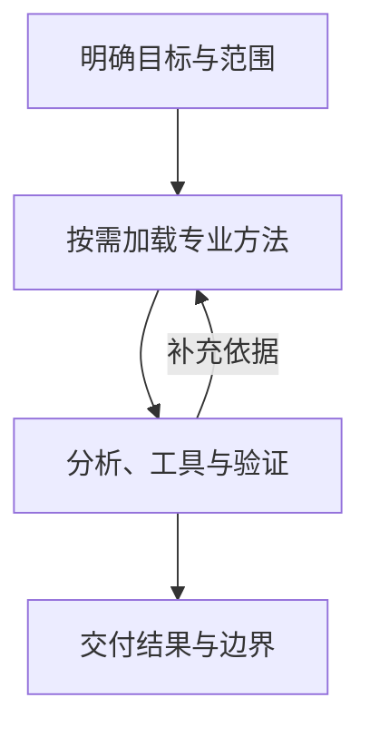

> **AI Craft 工程实践 · 第一篇。** 本系列记录各项目的设计、实现、验证与演进。本文的项目事实核对日期为 2026 年 9 月 13 日；RSI 部分是研究计划，尚不代表已运行的自我改进系统。

在把 AI 用进真实工作以后，我越来越关心一个问题：**一次任务做得不错，怎样变成下一次仍然可以依赖的能力？**

审查代码，需要确定检查范围，验证疑点，判断影响；设计界面，需要理解产品目标，尊重现有设计，再检查真实画面；分析经营问题，需要先统一口径，确定利润约束，才能讨论下一步动作。

这些工作都包含专业判断。模型可以参与判断，但仍然需要知道依据在哪里、先检查什么、什么时候补充信息，以及什么状态才算完成。

我把反复使用的方法逐步整理成了 AI Craft：一组由领域知识、任务路由、工具流程和验收机制组成的专业能力模块。部分项目带有确定性的运行工具，部分更侧重专业方法，browser67 则提供真实浏览器执行基础设施。它们共同体现了一种工作方式，也保留着不同的实现和成熟度。

## 从经验到可执行的方法

我过去做数据分析，习惯追问指标口径、事实来源和结论能否支持行动。这些问题进入 Agent 工作流后，会变成更具体的设计要求。

例如，“检查经营表现”还不足以形成清楚的任务。需要进一步确定研究时间、成交与退款口径、分析对象和可用数据。如果问题涉及投放，利润约束由谁给出？如果数据没有到齐，哪些判断可以继续，哪些应该暂缓？

这些要求可以拆成四类：

| 组成 | 要解决的问题 | 可能的实现载体 |
| --- | --- | --- |
| 领域知识 | 什么事实和约束影响判断？ | 专业参考、指标定义、来源说明 |
| 决策流程 | 先做什么，遇到分歧如何处理？ | Skill 指令、任务路由、职责划分 |
| 工具操作 | 怎样取得事实或执行检查？ | 宿主工具、脚本、API、浏览器运行时 |
| 验收机制 | 结果怎样被核对？ | 程序校验、运行记录、回归案例、人工判断 |

我在其中主要负责问题定义、专业知识拆分、流程和验收设计，并结合 AI 协作开发实现、检查和迭代。衡量这项工作的标准，是这些设计能否让任务更容易完成和验收，而非指令文件的长度。

## 怎样判断它的工程完整度

我不会用文件数量或流程图的规模判断一个 Craft 是否完整。更有用的标准是：在声明的任务范围内，它能否从输入走到交付，遇到失败时有没有明确状态，下一次修改能不能检验是否破坏了已有行为。

这里有三个不同的判断对象。

**方法是否完整**，看目标、专业依据、关键判断和验收要求是否相互衔接。例如，经营建议提出投放动作时，必须能够解释使用了什么成交口径和利润约束。

**工程是否完整**，看这些要求有没有对应实现。Review Craft 的源码绑定与覆盖校验、browser67 的实例身份与任务收尾、Money Craft 的来源审计与完成回执，都是可以沿代码和测试核对的机制。每项机制也有自己的适用范围。

**效果是否充分验证**，则需要在具体任务中比较质量、成本和稳定性。前两项成立，并不能直接替代第三项。本系列已有确定性回归和部分真实运行证据，尚未提供覆盖七个项目的统一任务效果实验。

因此，我会把当前 AI Craft 描述为：已经形成专业方法和工程机制、在若干任务路径上能够完成输入到验收的一组实践。工程完整度需要逐项目、逐路径说明，成熟度也会随着任务证据继续更新。

## 提示词、工作流和 Craft 是什么关系

在我的实现里，提示词承担专业指令的一部分，工作流组织步骤，工具取得事实或执行操作，验收决定哪些结论可以交付。这些都是构建 Craft 的材料；“Craft”是我给这种组织方式起的名字，并不是一个有统一行业定义的产品等级。

例如，要求模型“审查时给出证据”，需要进一步回答：证据指向哪版源码，如何识别位置错绑，发现无法确认时怎样表达，修改以后哪些记录应当失效。我做的设计工作，主要就落在这些从目标到行为、再到检查的连接处。

我没有因此把通用模型的推理能力归为自己的实现。我的贡献是选择需要解决的问题，拆分领域知识，确定宿主、专业方法和程序检查之间的职责，并把真实使用中暴露的问题转成可以复核的改动。

## AI Craft 怎样进入一次任务

从使用者角度看，一次任务通常经历下面的过程。图中是对共同方法的概括，不代表七个项目已经连接成一条统一的软件流水线。

任务路由的作用，是选择合适的方法和投入。一个边界清楚的局部问题，可以直接进入相应专业模块；需要跨专业权衡时，才增加协调流程。输入仍有关键缺口时，先补充信息，比提前运行一套完整流程更有用。

在这里，Agent 宿主承担推理和工具执行。Skill 提供专业方法与操作约定；脚本负责其中可以确定检查的部分；浏览器或其他外部工具提供真实环境中的观察与操作。最终结果还可能需要人工判断，例如设计是否符合产品气质、创意是否准确传达主张。

这几种职责必须分清。**写在 Skill 里的要求，是模型需要遵循的行为规则；由程序检查或权限系统执行的限制，才有相应的强制能力。**

## 七个项目，各自解决什么问题

我在作品集中用 AI Craft 组织了七项实践。它们的关系更适合用能力地图理解。

| 项目 | 主要问题 | 工程或方法重点 |
| --- | --- | --- |
| [Review Craft][review] | 一条审查发现为什么成立？ | 范围、候选验证、源码锚点、覆盖记录与交付依据 |
| [Design Craft][design] | 设计要求怎样落实到真实界面？ | 项目设计权威、任务范围、实现与视觉验收 |
| [Creative Craft][creative] | 模糊需求怎样成为可执行的创意方向？ | Brief、创意路线、艺术指导、制作与评估边界 |
| [browser67][browser] | Agent 怎样在真实浏览器中可靠地工作？ | 实例与标签页身份、所有权、传输和生命周期 |
| [Reverse Craft][reverse] | 研究结论怎样回到同一个对象和证据？ | 对象身份、专业路由、观察与假设、复现和封存 |
| [Money Craft][money] | 投资研究怎样保持事实与推断可追溯？ | 对象与时间口径、来源、勾稽、研究产物验证 |
| [commerce-growth-os][commerce] | 多专业经营建议怎样形成一致的决策？ | 专业职责、共享约束、领域路由和冲突处理 |

同一项目也可能包含多个可安装模块。例如 commerce-growth-os 所在仓库维护八个独立的 Commerce 与 Marketing Skills，使用声明的共享资源构建自包含包。browser67 则是有独立扩展与 hub 的运行项目，向 Agent 提供浏览器能力。

因此，我对“体系”的定义是：这些项目在专业方法、执行边界和证据要求上形成一致的设计思路。它不意味着所有项目共享部署入口、存储、状态机或评测器。已存在的具体协作，例如 Reverse Craft 的 JS 路线复用 browser67，可以在对应文章中沿实现展开。

## 用 Review Craft 看一次判断如何变得可核对

假设 Agent 在审查时看到一个异常处理分支，怀疑它会隐藏错误。这个疑点还需要继续确认：调用方期待什么行为？什么输入会触发？上层是否已有处理？失败对用户有什么影响？

这是说明性场景，不是本文声称完成的一次业务审查。它解释了 Review Craft 为什么区分候选问题与有效发现。

在完整审查路径中，候选记录包含位置、声称的影响、置信度、验证方法与剩余不确定性。当前 `review-craft.run.v5` 还把位置绑定到实际源码内容，防止一段结论换到另一份代码上后仍被当成同一项证据。覆盖记录则需要与原始文件清单对应，不能仅凭表格中的数量宣称范围完整。[Review Craft 当前实现][review]

这些机制让记录更容易核查，但源码哈希并不能证明业务判断正确。它能证明引用对象一致；问题是否成立，仍然需要推理、执行结果或其他适当证据。

下一篇将沿源码锚点、覆盖清单和交付检查的已有回归测试展开，具体解释这些约束怎样落地，以及它们不能证明什么。

## 我做了哪些取舍

### 让流程深度匹配任务

Review Craft 默认使用有界审查，可选的确定性 runtime 用于明确需要完整记录或更高保障的任务。Creative Craft 默认直接交付创意工作，需要多资产追踪等能力时才进入 Traceable Project。这两个项目的分层机制不同，但都体现了一个取舍：增加记录的收益，应当足以覆盖它的成本。[Review Craft][review]、[Creative Craft][creative]

### 让知识有明确归属

commerce-growth-os 将商业、运营、分析、增长等职责拆开，由构建工具把声明的资源装配进独立模块。这样做有助于减少同一规则在多个位置维护的负担，也要求我持续检查模块边界是否合理。[Commerce 与 Marketing Skill Pack][commerce]

### 把确定性检查放在程序里

字段类型、资源引用、文件身份和部分计算可以被程序检查。专业判断则需要保留它使用的事实、推断过程和适用条件。两种检查互相补充，不能用格式正确代替结论正确。

### 保持方法与宿主的边界

可移植 Skill 可以降低对某个宿主私有接口的依赖，但相同文件能够安装，不代表不同模型或宿主会产生相同效果。实际表现仍然要在对应环境里验证。

## 当前局限：有工程机制，还需要效果证据

现阶段能够从项目源码确认的，是模块、工具和验证合同的存在。由此不能直接推出“准确率更高”“显著节省成本”或“所有宿主表现一致”。本系列会把工具正确性、模型任务效果和真实业务结果分开报告。

首先，**确定性验证覆盖不了全部专业判断。** Review Craft 可以阻止不一致的源码引用，但无法仅凭 schema 确认真正的缺陷；Creative Craft 的方向评估，也无法代替对最终成品的观察。这个边界来自任务本身，需要适当的任务评测和人工判断补足。

其次，**流程本身需要预算。** 资料加载、补充验证、产物整理都会消耗时间和 Token。轻重路线已经提供了控制点，但到底节省多少、是否损失质量，仍然需要在相同条件下比较。这是待验证问题，本文不填写估算出来的收益。

第三，**规则维护可能成为长期成本。** 新案例带来新要求，旧规则却未必自动退出。重复、冲突和过时内容是后续需要持续检查的风险，不能用增加文档替代失败归因。

第四，**真实任务效果尚不能用一套数字概括。** 七个项目目标不同，既有可以精确计算的检查，也有依赖专家判断的创作与研究。统一分数容易掩盖差异，更合理的做法是先分别定义任务、基线与验收条件。

最后，**持续改进还需要更完整的实验链。** 失败分析、候选修改、独立评测和版本采用之间如何衔接，是我下一步希望推进的方向。本次源码核对不构成七个项目已运行统一自动改进系统的证据。

## 下一阶段：探索受控的自我改进

我希望引入 Recursive Self-Improvement，也就是递归自我改进。但第一步必须明确对象：近期计划研究的是 Skill 的规则、参考组织、任务路由和辅助工具，基础模型训练不在这份计划中。

Promptbreeder 同时演化任务提示词和产生修改的提示词，为“改进方法也可以成为优化对象”提供了研究参照。[Promptbreeder，2023](https://arxiv.org/abs/2309.16797v1)

Darwin Gödel Machine 让 Agent 迭代修改自身代码，通过编程任务评测筛选候选，并维护候选 Agent 档案。它提供了用实际任务结果检验自我修改的另一条路径。[Darwin Gödel Machine，本文参考 v3](https://arxiv.org/abs/2505.22954v3)

这些研究是设计参考，论文结果不是 AI Craft 的实验结果。针对自己的项目，我计划分三步推进：

| 阶段 | 改进对象与机制 | 验收重点 |
| --- | --- | --- |
| 经验驱动迭代 | 人根据案例修改规则和工具 | 原问题得到处理，相关行为没有回归 |
| 受控自我改进 | Agent 提出候选，在隔离副本中评测，再决定是否采用 | 未参与修改的任务表现、成本与退化 |
| 递归改进探索 | 新版本继续参与下一轮，也研究改进策略自身的变化 | 多轮增益、迁移能力和收益是否超过搜索成本 |

这是一份实施划分，不是行业通用的等级标准。一次改写提示词成功，也不足以证明持续的递归改进能力。

第一轮试点计划放在 Review Craft，采用固定目标与有限修改范围。用于诊断的案例和用于最终验收的任务分开；同一轮不允许候选自行降低验收标准。模型版本、任务预算和运行条件需要记录，失败候选也要留下原因。

这里最难的部分可能是评价。少报问题可以降低误报，却可能增加漏报；增加验证步骤可能改善结论，却让成本不可接受。只有把这些因素放进同一次对照，才知道候选是否值得采用。

后续如果实验有效，再研究失败诊断、候选生成和搜索策略能否改善下一轮迭代。权限边界、最终评测和发布控制会保持独立；研究机制的变化不会自动成为日常产品更新。

## 这个系列接下来怎样展开

七篇专题分别选择一个明确问题，说明输入、关键设计、可核验依据和当前限制。可以按顺序阅读，也可以从自己关心的工作领域进入：

- [Review Craft](/posts/ai-craft-02-review-craft-evidence-driven-review/)
- [commerce-growth-os](/posts/ai-craft-03-commerce-growth-os-domain-decisions/)
- [browser67](/posts/ai-craft-04-browser67-target-and-lifecycle/)
- [Design Craft](/posts/ai-craft-05-design-craft-authority-and-visual-evidence/)
- [Creative Craft](/posts/ai-craft-06-creative-craft-direction-and-output/)
- [Money Craft](/posts/ai-craft-07-money-craft-research-evidence/)
- [Reverse Craft](/posts/ai-craft-08-reverse-craft-reproducible-evidence/)

案例补篇：[测试全绿之后，我继续验证 Review Craft](/posts/ai-craft-09-review-craft-source-identity-case/)。它记录真实源码上的缺陷研究、环境误判、修复和独立复核，补充说明工程验证怎样被反例推进；这些结果尚不构成 RSI 收益证明。

具备实验结果后，我会再单独记录自我改进研究。

我希望读者最终能顺着文章回到源码，理解一次判断为什么这样产生，某条约束解决了什么问题，以及下一项改动准备怎样证明价值。这也是我继续建设 AI Craft 的工作标准。

## 技术信息与来源

以下链接固定到本次核对的源码 revision，表示文章依据，不表示对应版本已经在所有宿主或生产场景完成验证。Creative Craft 的工作区另有未提交候选；本文只采用下列已提交版本中的共同机制。文章中的示意场景与 RSI 路线不作为已完成实验。

| 项目 | 本文源码 revision |
| --- | --- |
| Review Craft | [`76b44945`][review] |
| Design Craft | [`8762cbe9`][design] |
| Creative Craft | [`7ff452e5`][creative] |
| browser67 | [`71baa17d`][browser] |
| Reverse Craft | [`f2f7aa22`][reverse] |
| Money Craft | [`2d33799b`][money] |
| commerce-growth-os | [`dea412e1`][commerce] |

[review]: https://github.com/bigKING67/review-craft/blob/76b44945ba2d2efa4665f6ad10842c860179bb1b/README.md
[design]: https://github.com/bigKING67/design-craft/blob/8762cbe995d70035dd03b7a52b94941650cc24ed/README.md
[creative]: https://github.com/bigKING67/creative-craft/blob/7ff452e57b54d9bd18bc89518fba8523c9a8144a/README.md
[browser]: https://github.com/bigKING67/browser67/blob/71baa17da2831992693bb1f63599ad90c3138230/README.md
[reverse]: https://github.com/bigKING67/reverse-craft/blob/f2f7aa22656391c64eb5d8cc0ace89cfc0471ea2/README.md
[money]: https://github.com/bigKING67/money-craft/blob/2d33799b939fab61fa842f0dfab420ed19239f19/README.md
[commerce]: https://github.com/bigKING67/commerce-growth-os/blob/dea412e14827965e4e6aaff1ca63fbb29dde7d28/README.md
