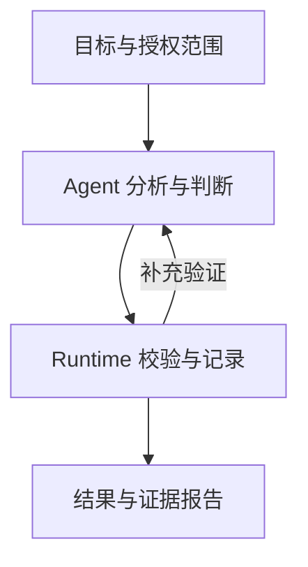

> **AI Craft 工程实践 · 第二篇。** 本文以 Review Craft `76b44945ba2d2efa4665f6ad10842c860179bb1b` 为源码依据。案例来自仓库中的合成测试 fixture，用于复现验证机制，不是客户项目审查，也不是模型准确率评测。RSI 部分为未实施的研究计划。

如果一份 AI 代码审查报告提出了十个问题，我最先关心的是：这些问题分别依据什么？

它检查的是哪一版代码？引用的位置是否仍然对应那段实现？报告说“已完整检查”，这个范围的分母从哪里来？建议修复之后，是否真的执行了验证？

Review Craft 就是围绕这些问题组织起来的。它是一个可移植的 Agent Skill，帮助宿主 Agent 理解项目、形成候选判断和验证发现；需要更完整证据时，再使用可选的 Python runtime 管理结构化记录与校验。[项目说明][readme]

我在这个项目里负责流程、证据标准和验证机制设计，并结合 AI 协作完成工程实现与迭代。本篇沿四层机制展开：源码身份、覆盖范围、候选与发现的关联，以及交付状态。

## 先决定一次审查需要多重

Review Craft 有两条使用路径。

默认的 bounded review 适用于范围清楚、能够完整读清楚的有界问题，直接交付有依据的判断。它不默认运行 preflight，不生成完整规范产物或数字评分。快速 PR 与小型 diff 则交给宿主原生 review。

明确需要全仓覆盖、规范化记录或更高保障时，才进入 canonical review。这里会建立范围和文件清单，维护候选与发现，按要求收集证据、验证和生成报告。对应的 `fast / standard / assured` 表示不同证据承诺；其中 `fast` 是受预算约束的临时性结果，`assured` 还有更高证据和独立验证要求。[产品边界][readme]

这个分层让高保障机制有明确用途。检查一个局部问题时，记录成本不应超过它带来的验收价值。

## Agent 与确定性工具如何分工

宿主 Agent 负责理解需求、阅读实现、提出疑点、选择验证方式并解释影响。Skill 描述这些工作的判断规则。可选 runtime 负责文件清单、结构化产物、源码绑定、证据引用、验证和报告等确定性工作。



图中描述 canonical 路径中的职责关系，不要求每个有界任务生成这些产物。runtime 不包含替代宿主推理的模型服务，也不会自动修改目标仓库；源代码修改由获得授权的宿主工具执行。

这条边界直接影响工程结构：安装产品集中在 `skills/review-craft/`，包含 Skill、参考、schema 和可选 runtime；仓库的 `tests/`、`scripts/`、`contracts/` 负责开发验证与包治理。[仓库规则][agents]

## 第一层：发现必须指向同一份源码

一个文件路径和行号，可以帮助读者定位，却不足以固定证据对象。文件内容可能改变；在 diff 中，被删除的文件甚至已经不在当前工作树里。

当前 `review-craft.run.v5` 使用源码锚点。除了路径、起止行和位置角色，还记录以下字段：

| 字段 | 含义 |
| --- | --- |
| `algorithm` | 原始行字节的锚点算法标识 |
| `sourceSide` | 使用当前源码 `CURRENT`，还是 diff 基线 `BASE` |
| `sourceSha256` | 整份源码字节的哈希 |
| `sourceLineCount` | 源码行数 |
| `spanSha256` | 所引用行片段的字节哈希 |

实现按 LF 分隔行，并保留 CRLF 和末尾行的原始字节。这使校验绑定到实际内容，避免展示或换行处理悄悄改变引用对象。构建位置之前，还会检查源码投影、工作树和 Git 状态是否相对 preflight 发生变化。[源码锚点实现][anchor]

仓库里的 `test_run_v5_rejects_missing_or_tampered_candidate_anchor` 提供了一个可复现案例。测试先创建合法记录，然后删除候选位置中的 anchor，要求验证失败；接着把候选和发现中的 `spanSha256` 同时改成错误值，再次要求失败。[回归测试][anchor-tests]

第二步尤其有意义：候选和发现即使相互一致，也可能一起偏离源码。校验需要重新计算源内容，才能识别这种情况。

对于已删除文件，另一个测试固定 Git base、删除工作树文件，再确认引用绑定的是 `BASE` 中的字节。由此可以解释“这条发现讨论的是哪一侧的实现”，而不必依赖文件现在是否存在。[删除文件锚点测试][anchor-tests]

**这个机制证明的是证据对象一致。** 它不能证明对该段代码的解释正确，也不能证明所有可能的运行条件都已经考虑。

## 第二层：覆盖率先要有可信的分母

如果审查者漏掉一个文件，再根据剩下的记录计算“全部完成”，表内数字仍然可能自洽。因此，覆盖记录需要回到原始范围产生的文件清单核对。

`_validate_coverage_inventory` 将覆盖记录中的路径集合与 canonical source projection 比较。缺少路径、多出路径，以及对应文件的身份字段不一致，都会产生错误。[覆盖验证实现][validation]

可以用下面的伪代码理解核心检查，实际实现还包含其他字段和状态约束：

```python
missing = inventory_paths - coverage_paths
unexpected = coverage_paths - inventory_paths
check_source_identity_for_shared_paths()
```

已有回归测试故意把 `app.py` 的记录替换成 `replacement.py`。记录数量没有变化，验证仍然同时指出：原清单路径缺失，以及出现非清单路径。另一个测试修改文件哈希或 untracked 属性，要求校验拒绝。[覆盖合同测试][coverage-tests]

这解决了“记录数量正确，但记录对象错了”的问题。

即便如此，**清单有完整交代，也不等于每份源码都完成了语义审查。** 排除、跳过、非语义文件与实际检查需要分别记录；报告中的 accounted coverage 与 reviewed coverage 也要区分。计数是一项范围约束，无法测量 Agent 理解代码的深度。[覆盖报告回归][coverage-tests]

## 第三层：候选怎样成为发现

候选记录包含 `claimedImpact`、`confidence` 和 `validation`。验证部分进一步记录状态、方法、证据引用和剩余不确定性。状态包括 `PENDING`、`CONFIRMED`、`LIKELY`、`NEEDS_MEASUREMENT`、`BLOCKED`、`REJECTED` 等，保留了不同判断结果的表达空间。[候选 schema][candidate]

例如，对“异常分支隐藏错误”的怀疑，需要继续核对调用链和触发条件。如果必须测量才能判断影响，可以保留测量需求；如果上层已有符合需求的处理，也可以驳回候选。这个例子用于说明分析方式，并非本文已执行的一次模型审查。

进入正式发现后，v5 还要求复用候选的位置锚点。已有测试只修改发现位置的 `role`，就会因位置不完全匹配被拒绝。这样，候选验证与最终发现之间不会悄悄换成另一组引用。[位置一致性回归][anchor-tests]

严重度与整改优先级也需要分别判断：问题可能影响很大，但整改依赖较长迁移；另一项影响较小，却可以低成本立即解决。最终建议还应考虑当前需求、已有调用方和变更成本，而不是为了产生修改而提出修改。[审查流程][readme]

## 第四层：修复尝试与交付分别留证据

审查发现本身不授予修改权限。用户选择整改范围后，宿主执行源代码修改，runtime 准备并检查外部证据。当前实现还支持不可变的修复尝试链和独立交付导出。[整改与交付边界][agents]

这里有一个容易被忽略的案例：如果 `git status` 执行失败，程序是否会误把空输出解释成干净工作树？

`test_git_status_failure_does_not_create_delivery_attestation` 在临时测试仓库中设置无效的 Git status 配置，触发查询失败，然后检查交付命令返回错误，且输出目录没有生成交付证明。[交付回归测试][delivery-tests]

这项检查强调：无法取得状态，就不能据此宣称状态满足要求。

同一测试模块还验证仅有本地交付证据时，结果保持 `PARTIAL`，并能在复制产物后进行验证。远端 push 与 GitHub Actions 证据需要明确选项和对应记录。离线测试中对这些接口的模拟，不是一次真实远端发布验证。

## 本文怎样复现这些机制

本篇使用仓库已有测试，没有创建一套复述实现的新测试。以下命令在本文固定 revision 的项目根目录运行，测试使用临时仓库和合成记录：

```bash
PYTHONDONTWRITEBYTECODE=1 uv run --locked python -m unittest -v \
  tests.contract.test_contracts.ContractTests.test_run_v5_binds_coverage_rows_to_the_canonical_inventory \
  tests.contract.test_contracts.ContractTests.test_run_v5_coverage_paths_match_the_canonical_inventory \
  tests.unit.test_source_anchor.SourceAnchorTests \
  tests.unit.test_delivery.DeliveryTests.test_git_status_failure_does_not_create_delivery_attestation \
  tests.unit.test_delivery.DeliveryTests.test_local_only_delivery_is_partial_and_portable
```

2026 年 9 月 13 日，在上述 revision 的本地环境运行这条命令，11 项测试全部通过，用时约 10.8 秒。这组测试检查覆盖身份、源码锚点、位置关联、Git 查询失败和本地交付边界。它们是确定性工具验证，不调用模型，不证明 Agent 发现了真实项目中的缺陷，也不证明某个宿主加载 Skill 后的质量提升。

要验证模型审查效果，还需要固定任务、模型和预算，以独立判断的缺陷及非缺陷案例作为参照，观察误报、漏报、有效证据与成本。主仓库当前将模型比较、真实宿主评测和研究实验放在普通确定性发布门禁之外。[研究与发布边界][agents]

## 当前限制与需要改进的地方

### 证据一致性距离结论正确性还有一层

源码锚点和引用校验可以发现错绑、缺失与不一致，却无法代替领域知识和运行验证。即使所有结构都正确，Agent 仍可能误解需求或漏掉调用关系。后续需要用真实任务评测这部分能力，而不能继续增加字段来假装问题已经解决。

### 完整审查有维护与执行成本

产物、schema、版本兼容和证据整理都需要维护。bounded 与 canonical 的分工控制了一部分成本；何种任务值得升级证据深度，仍需要结合质量、耗时和人工介入记录评估。当前文章没有证明完整流程在所有任务上收益更高。

### 验证范围不是一个无限承诺

当前实现关注范围内的证据和状态，无法因为一次覆盖校验通过，就宣称全系统没有遗漏。外部服务、运行数据、特定宿主和生产环境的事实，仍需要各自的验证方式。当前仓库也没有把自动源码修改、深度多轮审查等设想声明为已实现功能。[产品边界][agents]

### 数字评分需要独立校准

确定性评分让同一组输入更容易复算，但它仍依赖评分规则、输入判断与证据质量。要证明分数能够代表实际项目风险，还需要与专家判断、真实缺陷和后续结果比较。本篇不把可重复计算当成准确性证明。

## 下一步实验：让改进本身也能被验证

Review Craft 是我计划开展受控自我改进的第一个试点。这里讨论的是未来研究设计，当前产品不会自动修改自身或目标仓库，也没有本文所述的持续 RSI 实验结果。

### 先把一次候选修改说清楚

首个实验拟聚焦调用链核对：Agent 分析已确认的误报、漏报或验证不足，提出一项有限修改。例如，在异常处理审查指导中增加“先检查调用方的错误恢复约定”，再观察它是否减少某类误判。

这是待测试的候选思路，本文没有确认当前版本存在这一具体缺陷，也没有把增加这条规则认定为有效修复。它可能减少误报，也可能让模型对真正被吞掉的错误过于宽容。实验必须同时观察两边的变化。

首轮将修改范围限定为一段审查指导或参考组织，保留固定程序校验。若后续研究辅助工具修改，另设实验批次，以便判断收益来自哪项变化。最终评测、权限规则和发布控制不进入候选的修改范围。

### 对照要能区分规则收益和额外投入

实验拟设三个条件：同一宿主的原生审查、固定版本 Review Craft、候选版本 Review Craft。原生审查提供背景参照，判断候选是否值得采用的主要比较是后两者；不会仅凭一次原生对照，就概括所有宿主的优劣。

三个条件使用相同任务输入、基础模型版本和可用工具，并预先固定每次任务的 Token、耗时和工具调用上限。调用顺序交错安排，执行环境相互隔离，避免前一次留下的记录进入下一次。需要重复时，重复次数在看结果前确定；只报告最好的一次没有比较意义。

候选生成另有预算，不混进任务执行预算。最终同时报告运行一个任务的成本，以及为得到这个候选付出的总搜索成本。

### 数据划分先于候选生成

诊断集用于理解问题，开发验证集用于筛选候选，最终留出集只用于阶段验收。同一缺陷的修复前后版本、近似变体和高度相关的同仓案例，按组划分，避免换一段描述就被当成未见任务。

案例需要包含有已确认缺陷的代码，也包含按已知需求可以解释为合理行为的代码。缺陷位置、触发条件和影响由独立裁定记录支持；无法达成判断的项保留争议状态。缺陷清单可能不完备，因此召回率只针对已经裁定的目标缺陷，不解释为“发现了所有真实缺陷”。

开发阶段选定一个候选之后，再进入最终验收。留出结果一旦用于修改下一轮规则，它就进入了开发历史；下一阶段需要新的独立任务。反复试到同一份留出集变好，会失去原本想验证的泛化含义。

### 指标需要堵住两种取巧方式

只少报问题可能减少误报，大量列举疑点可能增加命中。评价要同时记录输出数量、有效发现与遗漏，不能只选其中一个好看的数字。

- **有效发现比例**：裁定成立的独立发现数 / 已裁定的独立报告项数。相同问题去重，未决项单列。
- **已知缺陷召回**：命中的目标缺陷数 / 已裁定的目标缺陷数。同时列出不同缺陷类型的结果。
- **合理代码上的误报**：在合理代码任务中提出的已裁定错误发现数，并报告每任务分布。
- **证据有效性**：分别检查源码绑定是否有效、证据是否支持触发条件与影响，两项不合成一个字段。
- **执行与人工成本**：Token、耗时、工具调用、超时与失败次数，以及裁定和复核所用时间。

没有报告任何问题时，有效发现比例的分母为零，应标为不适用，并报告空输出次数；不能记成 100%。超时和执行失败也保留在结果中。对含已知缺陷的任务，失败且未交付有效发现仍会体现为未命中，不能从统计中删除困难任务。

判断者不看候选身份，先按同一标准裁定输出，再计算差异。结果按任务配对报告，并保留重复运行的波动；相关案例按组处理，避免把同一问题的多个变体当成大量独立证据。

### 什么情况下采用、停止或重做实验

运行前将最低可接受收益、关键缺陷退化容忍度和成本上限写入实验配置。这里先给出配置要求，尚未确定真实任务分布与预算，因此不填一个看似精确的通用阈值。

候选首先必须通过已有确定性回归，再检查任务效果。确定性检查通过，只允许它继续参评；最终是否采用，还要看未见任务上的收益是否达到预先约定的标准，同时没有越过退化与成本边界。证据不足时保留原版本，不把微小分数差异直接宣布为改进。

达到预定搜索预算、发生不允许的行为变化，或评测数据与环境失去独立性时停止本轮。分别记录候选被拒绝、预算耗尽和实验无效；这三种情况需要不同的后续处理。失败候选、版本差异、运行条件和裁定记录都属于实验报告的一部分。

在受控改进能够稳定复现以后，才进一步研究递归性：经过验证的新版本能否更好地诊断下一轮失败、生成更有效的候选，或者改善搜索策略。Promptbreeder 对修改策略的演化，以及 Darwin Gödel Machine 对 Agent 代码修改和评测筛选的研究，是这条路线的参考，不是本项目已经获得的成果。[Promptbreeder](https://arxiv.org/abs/2309.16797v1)、[Darwin Gödel Machine](https://arxiv.org/abs/2505.22954v3)

近期我最希望回答的问题是：**在固定预算下，Agent 提出的修改，能否在未见任务上带来可复现的净收益？** 如果答案是否定的，失败归因和被拒绝的候选，同样值得成为下一篇实验报告的内容。

系列阅读：[系列总览](/posts/ai-craft-01-from-expertise-to-agent-capabilities/) · [下一篇：commerce-growth-os](/posts/ai-craft-03-commerce-growth-os-domain-decisions/)

## 技术信息与源码入口

- 核对日期：2026 年 9 月 13 日。
- 源码 revision：`76b44945ba2d2efa4665f6ad10842c860179bb1b`，项目版本文件为 `0.7.2`。
- 运行协议：新建审查使用 `review-craft.run.v5`；本文没有执行一次 canonical 全仓审查。
- 证据层：本地源码与指定的确定性测试；不包含真实模型审查对照、所有宿主运行或生产效果证明。
- 范围：本文记录机制和研究计划，不修改 Review Craft 产品或启动付费模型实验。

[readme]: https://github.com/bigKING67/review-craft/blob/76b44945ba2d2efa4665f6ad10842c860179bb1b/README.md
[agents]: https://github.com/bigKING67/review-craft/blob/76b44945ba2d2efa4665f6ad10842c860179bb1b/AGENTS.md
[anchor]: https://github.com/bigKING67/review-craft/blob/76b44945ba2d2efa4665f6ad10842c860179bb1b/skills/review-craft/lib/review_craft/source_anchor.py
[validation]: https://github.com/bigKING67/review-craft/blob/76b44945ba2d2efa4665f6ad10842c860179bb1b/skills/review-craft/lib/review_craft/review_validation.py
[candidate]: https://github.com/bigKING67/review-craft/blob/76b44945ba2d2efa4665f6ad10842c860179bb1b/skills/review-craft/schemas/candidate.schema.json
[anchor-tests]: https://github.com/bigKING67/review-craft/blob/76b44945ba2d2efa4665f6ad10842c860179bb1b/tests/unit/test_source_anchor.py
[coverage-tests]: https://github.com/bigKING67/review-craft/blob/76b44945ba2d2efa4665f6ad10842c860179bb1b/tests/contract/test_contracts.py
[delivery-tests]: https://github.com/bigKING67/review-craft/blob/76b44945ba2d2efa4665f6ad10842c860179bb1b/tests/unit/test_delivery.py
