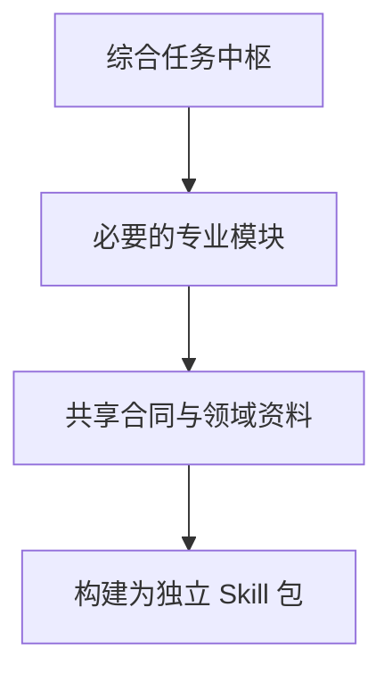

> **AI Craft 工程实践 · 第三篇。** 本文依据 `dea412e14827965e4e6aaff1ca63fbb29dde7d28`。金额和比例来自仓库合成 fixture，仅说明计算机制；不代表真实品牌损益、投放建议或业务收益。自我改进部分为研究计划。

投放 ROI 为 2.0，就可以继续加预算吗？仓库里的一组简化测试给出了一个值得展开的场景：30 万 GMV、15 万广告消耗，在扣除已列成本后，模型余额仍为 −3.9 万。这个数字只属于合成测试，但它提示了经营判断中需要先说清楚的问题：收入和成本怎么算，哪些信息还没有进入模型。

我在设计 commerce-growth-os 时，关注的就是这些判断怎样衔接：什么问题应该交给哪个专业，哪些约束需要先确定，发生冲突后由谁收敛为一个可以执行的决定。

它所在的仓库目前维护八个 Commerce 与 Marketing Skills。我的工作是把经营知识拆成可组合的专业模块，明确规则归属，再用构建、计算和评测工具支撑这套方法。[项目说明][readme]

## 一个 ROI 数字，还没有说清楚什么

仓库有一个单位经济模型测试，使用以下合成输入：GMV 30 万、广告消耗 15 万、毛利率 55%，赠品、履约和退款损失各占 GMV 的 6%。

在这个简化 fixture 中，计算关系为：

| 项目 | 计算 | 合成结果 |
| --- | --- | --- |
| 投放 ROI | 30 万 ÷ 15 万 | 2.0 |
| 扣除已列非广告成本后的贡献率 | 55% − 6% − 6% − 6% | 37% |
| 可覆盖广告支出的贡献金额 | 30 万 × 37% | 11.1 万 |
| 扣除广告后的模型余额 | 11.1 万 − 15 万 | −3.9 万 |
| 简化盈亏平衡 ROI | 1 ÷ 37% | 约 2.7027 |

这对应测试中的 `roi`、`break_even_roi` 和 `channel_net_profit` 输出。测试会检查数值，而不是让模型自由复述公式。[单位经济模型回归][economics-tests]

但这些结果成立，有明确前提：收入、毛利和广告属于同一对象与口径；未列出的成本在这一非 strict fixture 中按零处理。现实中如果平台费、样品、服务费、固定成本分摊等尚未确认，就不能把这里的余额称为完整的真实净利润。收入是退款前还是退款后，退款损失是否已包含在毛利中，也需要先明确，避免重复扣减。

因此，这个例子能够证明一组输入如何被计算，无法单独回答真实业务能否加预算。

## 先确认是不是同一批订单

经营分析容易出现一种隐蔽错误：几个数字都是真的，但它们描述的对象不同。

例如，全品牌客单价、店铺总体毛利和广告归因 ROI，不能因为时间相同就直接相乘。非付费订单、不同 SKU 和退款状态，都可能改变结果。

当前中枢方法要求先确认渠道、SKU 或订单人群、收入基准和退款状态一致。如果无法确认，应列出缺少的数据；需要做假设性计算时，把对象一致性写成额外假设，且在后续表格中继续沿用这一前提。[中枢执行顺序][os]

这属于给 Agent 的专业判断规则。单次计算器只看得到传入字段，无法自动证明每个数字来自同一批订单。规则约束与输入来源验证因此需要配合，不能因为计算器返回成功就跳过口径核对。

## 专业职责怎样划分

仓库将专业能力划分为以下模块。它们是可独立发现和使用的 Skills，不意味着一次任务必须启动八个代理。

| 模块 | 主要职责 |
| --- | --- |
| Commerce Growth OS | 综合经营诊断与跨专业协调 |
| Commercial Strategy | 单位经济、价格、货盘、预算与渠道进入约束 |
| Operations | 店铺、直播、活动、履约与售后执行 |
| Analytics | 指标口径、证据、归因限制和异常诊断 |
| Consumer Marketing OS | 整合营销目标与跨营销专业协调 |
| Brand Strategy | 品牌定位、公关、合作与声誉 |
| Content / Social | 内容体系、创意方向、达人 Brief 与素材使用 |
| Growth / Lifecycle | 付费增长、实验、CRM、留存与边际放量 |

有清晰边界的问题直接进入对应专业，多个专业共同完成一项有界交付时也可以直接组合。只有完整方案、综合诊断或真正的跨域冲突，才需要中枢。[模块及 ownership 规则][readme]

例如，Analytics 可以判断某个 ROI 下降是否具有可信证据；商业侧负责利润与投入边界；增长侧在已确认或明确待确认的约束内设计实验；运营确认执行条件。把这些职责写清楚，能够让不同建议回到同一个决策对象。

这里的 owner 是知识与判断责任的归属，不是新增组织岗位，也不意味着软件已经取得执行预算或修改业务系统的权限。

我的取舍是让专业边界随问题被调用。上面的 ROI 场景，如果只需要核算已确认成本，应直接使用商业专业能力；当问题扩展为“为什么下降、是否值得继续、下一轮怎么试”，才需要分析、商业与增长共同参与。协作深度由尚未解决的判断决定，这也给后续路由评测提供了具体依据。

## 知识拆分怎样落到工程里

项目使用一个仓库维护入口、专业资料、共享合同和平台覆盖资料。依赖方向为：



图中的构建发生在分发环节，前三层表示知识依赖。运行时并不临时编译一个 Skill。

专业模块不直接读取兄弟目录，构建器只把声明的资源装配进自包含 bundle。这样既保留共享规则的维护入口，也避免安装某个 Skill 后依赖仓库里未一起安装的文件。[架构与构建合同][readme]

这种设计也有代价：资源声明、引用和模块隔离需要持续验证。项目因此提供 bundle 校验、schema 检查、安装一致性与事务式安装机制。安装器会先准备选定目标，再进行替换和失败恢复，不顺带清理无关 Skills。

“源文件存在”“包能独立安装”和“宿主实际按规则执行”仍是不同问题。前两层可以用确定性工具检查，第三层需要真实任务证据。

## 计算器如何处理输入缺口

`unit_economics.py` 对字段、数值与成本表示做检查。未知字段会被拒绝并尽可能给出拼写建议；布尔值和非有限数值不能混进金额；strict 模式要求显式提供必要成本与目标利润输入。[计算器源码][economics]

已有回归还检查金额与比例冲突。例如，平台费金额与费率算出的金额不一致时，strict 模式拒绝继续；非 strict 模式则保留可观察的警告。这里的选择是让假设保持可见，而不是默默替用户决定应该相信哪组输入。

这些检查减少了输入错误和公式执行错误，却仍依赖业务人员提供合理口径。工具不掌握未输入的库存风险、合同条件和后续需求变化，结果需要在它的输入边界内解释。

## 评测为什么分成多层

仓库分别维护路由、执行、结构化 Judge 和负例校准材料。它们回答的问题不同：

- 路由是否选择了合适的专业能力？
- 显式使用某个 Skill 后，答案有没有遵循任务要求？
- Judge 是否能够识别答案中的实质问题？
- 已知有问题的答案，会不会被错误判为通过？

其中补充的 economics regression cases 将两份已记录失败答案与编辑过的正向控制配对，用于检查订单范围和收入、退款、目标利润口径。编辑过的控制样本可以检验评价机制的区分能力，不能当成模型重新生成的成功结果。[评测分层说明][readme]、[补充案例定义][regressions]

这个区别直接影响我如何报告效果：静态样例通过，只说明规则能够处理这些样例；真实答案质量必须回到实际模型调用、答案文件和独立判断。

本篇没有运行模型评测或投放实验。2026 年 9 月 13 日，我运行了下面的已有确定性回归，结果通过：

```bash
PYTHONDONTWRITEBYTECODE=1 python3 \
  skills/commerce/commerce-commercial-strategy/scripts/test_unit_economics.py
```

它验证计算与输入合同，不提供真实品牌经营效果或当前平台政策证据。

## 当前局限与改进顺序

第一，模块职责可以写得清楚，模型在复杂表述下仍可能选错路线。后续需要补充模糊输入、跨专业但无需中枢的任务，以及事实不足时应当收窄结论的案例。

第二，指标的来源关系还需要更强的显式表达。仅有字段类型，难以识别“全品牌毛利混入付费人群计算”。近期值得研究的是让关键输入携带渠道、订单范围和收入基准，再评估这种结构带来的收益与录入成本。

第三，平台资料会变化。官方入口可访问，只能证明链接可达，不能证明费用、权限和功能仍然适用。使用这些事实作决定前，仍需对应日期的官方或后台证据。

第四，Judge 可能理解错误，也可能被写作风格影响。需要持续使用负例、不同表达和独立复核检查它；不能把一个更高的 Judge 分数直接换算成经营收益。

## 自我改进首先可以研究什么

本篇沿用 [Review Craft 专题中的对照与留出评测设计](/posts/ai-craft-02-review-craft-evidence-driven-review/#下一步实验让改进本身也能被验证)，下面只展开本领域的改进对象与特殊风险。

我希望先研究有边界的改进：让 Agent 根据已确认的口径错误和路由失败，提出最小规则修改，再在未见任务中检查误用是否减少。

候选可以尝试调整说明顺序、补充消歧条件或合并重复规则；基础计算、最终评分标准和授权边界保持独立。新增一条约束时，也要检查它有没有让正常任务频繁停下，或增加不必要的中枢调用。

评价指标应同时包含路由适当性、口径错误、无依据建议、信息不足时的处理，以及任务成本。最终希望验证的是：经验能否转化为可迁移的规则，而不是让系统记住某几个固定金额的答案。

如果第一阶段能够稳定复现收益，再探索候选生成和失败分类机制自身的演化。这里尚未开展 RSI 实验，更没有自动调整真实经营预算。

系列阅读：[系列总览](/posts/ai-craft-01-from-expertise-to-agent-capabilities/) · [上一篇：Review Craft](/posts/ai-craft-02-review-craft-evidence-driven-review/) · [下一篇：browser67](/posts/ai-craft-04-browser67-target-and-lifecycle/)

## 技术信息与来源

- 源码 revision：`dea412e14827965e4e6aaff1ca63fbb29dde7d28`。
- 本篇实测：单位经济模型既有回归通过；未调用模型、读取账户或执行经营动作。
- 合成计算案例不包含完整真实成本，结果只在明确假设下成立。
- 后续最需要补足的证据：未见任务的口径与路由表现，以及人工决策中实际节省的成本。

[readme]: https://github.com/bigKING67/commerce-growth-os/blob/dea412e14827965e4e6aaff1ca63fbb29dde7d28/README.md
[os]: https://github.com/bigKING67/commerce-growth-os/blob/dea412e14827965e4e6aaff1ca63fbb29dde7d28/skills/commerce/commerce-growth-os/SKILL.md
[economics]: https://github.com/bigKING67/commerce-growth-os/blob/dea412e14827965e4e6aaff1ca63fbb29dde7d28/skills/commerce/commerce-commercial-strategy/scripts/unit_economics.py
[economics-tests]: https://github.com/bigKING67/commerce-growth-os/blob/dea412e14827965e4e6aaff1ca63fbb29dde7d28/skills/commerce/commerce-commercial-strategy/scripts/test_unit_economics.py
[regressions]: https://github.com/bigKING67/commerce-growth-os/blob/dea412e14827965e4e6aaff1ca63fbb29dde7d28/eval/structured-judge/economics-regression-cases.json
