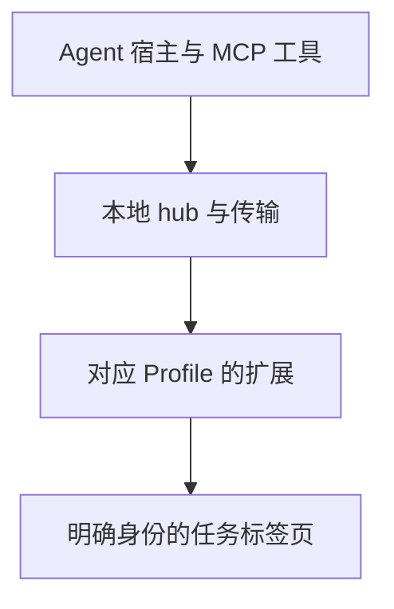

> **AI Craft 工程实践 · 第四篇。** 源码依据为 `71baa17da2831992693bb1f63599ad90c3138230`。运行案例来自本系列本地博客草稿验证，范围为 macOS、Chrome 与 localhost，不代表其他平台、外部登录流程或源码与安装态逐文件一致性已验证。

写这个博客系列时，我拿到过一张工具已经成功保存、却没有拍到正文图表的 PNG。页面标题和章节都存在，截图文件也存在，但打开图片后，目标区域是一片空白。这次实际经历让我再次确认：浏览器任务需要检查的，不只是命令有没有返回成功。

真实工作环境里可能同时存在多个 Profile、不同账号、用户正在阅读的页面，以及 Agent 自己创建的任务页。一次技术上成功的点击，如果落在错误目标上，就没有完成原来的任务。

browser67 是我在 AI Craft 系列中的执行基础设施项目。它基于 GenericAgent / TMWebDriver 的相关底座演进，通过 Chrome 或 Edge 扩展、本地 hub 和 MCP 工具连接真实浏览器，重点处理目标身份、页面所有权、生命周期与证据。我的工程工作围绕这些边界展开；上游来源与吸收记录在项目中单独维护。[项目说明][readme]

## 控制链路中的几种身份

默认链路可以概括为：



hub 和传输负责消息到达，扩展在对应 Profile 中执行浏览器操作。但“传输连通”不等于“业务目标正确”。系统还要确认请求绑定的浏览器实例和标签页。

browser67 使用 `(browser_instance_id, tab_id)` 表达目标身份。前者是 Profile 对应的不透明实例 ID，不能从名称、路径或最近活动推断。多实例时需要显式选择；目标有歧义或不可用时，返回错误，而不自动选第一项或最新标签页。[目标与运行边界][readme]

这种约束也适用于失败处理。登录态任务不能在默认传输失败后，悄悄切到另一套调试浏览器并继续宣称操作同一账号。受控 CDP 场景可以有明确用途，但需要在任务开始时建立对应边界。

## 同一个 tab ID，为什么还要检查实例

仓库有一个很直接的合同测试：给实例 A 建立一个采用页面的临时授权，再尝试在实例 B 上使用它，即使两边的 tab ID 字符串相同，也必须被拒绝。

`assertAdoptionBrowserInstanceBinding` 分别检查采用和关闭授权。错误为 `ADOPTION_TARGET_CHANGED`；错误尝试还不能消耗原本有效的授权记录。[跨实例合同测试][binding-test]

这项检查把“用户同意操作某个页面”绑定到实际目标，防止授权在实例之间被误用。它是运行方法的确定性测试，不需要触碰真实用户页面。

2026 年 9 月 13 日，我运行了这个已有合同，结果通过：

```bash
node --input-type=module -e '
import { assertAdoptionBrowserInstanceBinding } from "./contracts/browser67-browser-mcp-contract/adoption-browser-instance.mjs";
await assertAdoptionBrowserInstanceBinding();
console.log("PASS: cross-instance adoption and close-token binding");
'
```

测试覆盖的是授权对象一致性，不证明所有页面动作都已经接受过真实浏览器验证。

## 三种页面所有权

目标身份说明操作在哪里，所有权说明允许怎样操作。

| 页面类型 | 进入方式 | 任务结束时 |
| --- | --- | --- |
| Agent 创建的 managed 页 | 按任务创建或复用 | 默认关闭 `keep:false` 的任务页 |
| 用户明确允许操作的 adopted 页 | 先检查精确目标，再采用 | 默认释放采用关系，保留用户页面 |
| 普通 unmanaged 页 | 用户自身的页面 | 只在任务范围内只读观察，不纳入任务清理 |

采用关系还与页面、连接和授权代次有关。用户或外部导航改变了页面状态后，原来的关系可能进入 suspended，后续需要重新检查。一次采用不是对未来所有页面状态的永久授权。[页面所有权规则][agents]

这个划分使 Agent 的工作可以与用户的浏览共存。它也增加了状态管理成本：页面移动、扩展重连和任务中断都需要保持明确语义，而不能只保存一个 URL。

## 后台工作与视觉证据需要分别判断

任务页默认进入专用窗口，使用 `background_preferred` 和 `active:false`。普通导航、提取与脚本执行不需要抢占前台。确实需要物理输入或可见交接时，再按明确条件处理焦点。[窗口与焦点边界][agents]

专用窗口隔离的是任务页面和焦点使用；它仍属于同一 Profile。比如浏览器的 debugger 提示可能在 Profile 层面可见，因此不能将这种安排描述为完整的 Profile 隔离。

后台页面还暴露了另一种差异：DOM 已加载，不代表所有离屏区域都已经完成可截图的绘制。

写本系列前两篇时，我先通过 browser67 创建后台任务页，确认文章标题和章节存在。第一次直接对离屏流程图做 selector 截图，工具写出了 PNG，但查看像素后发现画面为空白。这张图被记为无效样本，没有用于视觉通过结论。

随后把同一个任务页滚动到图表区域，再捕获 viewport，获得有效截图。390×844 检查则同时核对临时 viewport 的实际值与 PNG 尺寸，并在结束时清除覆盖。这里没有为了截图切换到另一个浏览器或用户页面。

这个案例说明：**开页成功、DOM 正确和画面有效，是三个不同阶段。** 一张有路径、有哈希的 PNG，也需要确认它实际拍到了所需内容。

## 页面任务怎样结束

任务结束时，调用 `finalize_task`，以同一实例和当前 workspace / task 限定范围。源码中的 scope 解析会拒绝不明确的清理目标；如果一个范围涉及多个浏览器实例，需要指定实例，或提供明确的跨实例确认。[范围解析实现][scope]

收尾还区分关闭任务页、保留 `keep:true`、释放 adopted 关系和终态化本任务运行记录。回执包含实际关闭数量、关闭核验、剩余页面和错误信息。[生命周期合同][lifecycle]

在前两篇草稿验证中，我在同一 managed tab 内依次查看两篇文章；完成后，回执确认关闭并核验 1 个任务页，剩余未保留任务页为 0，错误为 0。原有用户页面与博客开发服务均保留。这是一次具体 localhost 任务的运行证据，不是跨平台稳定性测试。

这种收尾让“任务完成”多了一项可核验条件：不仅有文章或截图，也知道本次占用的页面资源如何处理。

这里的设计取舍，是在 Agent 创建页面时就记录归属和保留意图，让收尾沿着同一任务范围执行。它要求维护更多生命周期状态，却让清理依据来自明确记录；页面标题或 URL 相似，并不足以决定某个用户页面是否应该关闭。

## 浏览器操作与 JS 研究怎样共享底座

browser67 提供普通浏览器工具与 `js-reverse` 两个 MCP 表面。后者负责脚本发现、请求来源、Hook 与证据导出等研究操作，两者共享浏览器运行时身份和生命周期。[能力表面][readme]

共享底座可以减少同一个网页被两套系统分别表示的漂移。它并不意味着普通任务默认开启所有观察能力：网络、控制台和文件证据仍应按任务开启，设置范围与数量限制。

因此，文章讨论的是可组合的执行能力。一次本地草稿检查不需要读取 cookie、用户账号或外部站点历史，也不能据此声称已验证真实登录业务。

## 当前限制与工程代价

首先，可靠性横跨宿主、传输、hub、扩展和浏览器。某一层健康不能覆盖其他层的失败。错误报告需要尽量保留失败阶段，避免把工具编排停滞误判成页面加载慢。

其次，后台渲染具有实际限制。DOM 验证可以保持后台执行，但视觉验收仍要检查像素是否有效。本次 selector 空白是具体样本，不足以推出所有后台截图都会失败，也不能靠重试次数推导稳定性。

第三，Profile、所有权和焦点规则越明确，生命周期就越复杂。测试需要覆盖采用关系失效、实例消失、用户移动任务页和中断收尾等情况；一次顺利的 localhost 操作不能替代这些负向场景。

第四，平台与站点兼容性要逐项建立。本文没有在 Windows、Edge、外部 SSO 或复杂下载流程上补做验证，不把当前 Mac 样本扩展到这些环境。

## 自我改进先从失败分类开始

本篇沿用 [Review Craft 专题中的对照与留出评测设计](/posts/ai-craft-02-review-craft-evidence-driven-review/#下一步实验让改进本身也能被验证)，下面只展开本领域的改进对象与特殊风险。

我希望优先研究等待策略、页面就绪判断和诊断提示的改进，而让目标身份、页面所有权与焦点授权保持独立约束。

候选可以提出更合适的 DOM 等待条件，或者根据失败阶段减少无效重试。验证时应在受控页面中注入延迟、导航、断连和内容变化，比较成功率、耗时、错误分类与资源泄漏。必须包含目标歧义和失效授权的负例，避免系统为了提高完成率而绕开原有边界。

如果这些改进能够在未见页面上复现，再研究候选生成和诊断策略能否持续进化。这是 RSI 的一个可能入口，当前没有自动让线上浏览器修改自身策略或放宽权限。

对 browser67 来说，一个值得采用的改进，应该让任务更容易完成，也让错误目标更难被操作。两者需要在同一组评测里成立。

系列阅读：[系列总览](/posts/ai-craft-01-from-expertise-to-agent-capabilities/) · [上一篇：commerce-growth-os](/posts/ai-craft-03-commerce-growth-os-domain-decisions/) · [下一篇：Design Craft](/posts/ai-craft-05-design-craft-authority-and-visual-evidence/)

## 技术信息与来源

- 源码 revision：`71baa17da2831992693bb1f63599ad90c3138230`。
- 本篇确定性实测：跨实例采用与关闭授权合同通过。
- 运行案例：2026 年 9 月 13 日本系列前两篇本地草稿的 managed-tab 验证与 scoped finalize。
- 未覆盖：其他平台与站点业务、持续稳定性实验、源码和安装态完整一致性验证。

[readme]: https://github.com/bigKING67/browser67/blob/71baa17da2831992693bb1f63599ad90c3138230/README.md
[agents]: https://github.com/bigKING67/browser67/blob/71baa17da2831992693bb1f63599ad90c3138230/AGENTS.md
[scope]: https://github.com/bigKING67/browser67/blob/71baa17da2831992693bb1f63599ad90c3138230/src/browser-wrappers/tab-lifecycle-scope.mjs
[binding-test]: https://github.com/bigKING67/browser67/blob/71baa17da2831992693bb1f63599ad90c3138230/contracts/browser67-browser-mcp-contract/adoption-browser-instance.mjs
[lifecycle]: https://github.com/bigKING67/browser67/blob/71baa17da2831992693bb1f63599ad90c3138230/contracts/browser67-browser-mcp-contract/tab-lifecycle-ops.mjs
