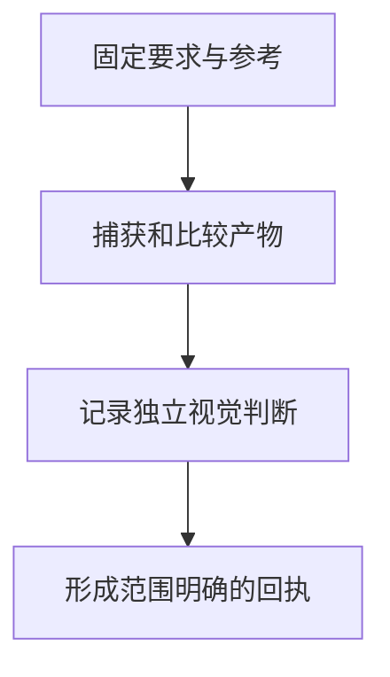

> **AI Craft 工程实践 · 第五篇。** 本文依据 `8762cbe995d70035dd03b7a52b94941650cc24ed`。实测对象是已有的合成图像和校验 fixture，未在本文重新设计产品界面，也不将像素测试当作审美质量证明。

在 Design Craft 的一个合成图像测试里，比较器记录的 changed-pixel ratio 为零，最终视觉状态却仍是 pending。这个结果是有意保留的：差异没有超过测量阈值，并不能自动说明某个人已经认可画面。它是理解这套设计工程方法的一个入口。

同样一组组件，放在不同产品里可能需要完全不同的处理。金融工作台、个人博客与移动端工具，各自有用户目标、品牌语言和交互习惯。一次局部修改还需要与页面其他状态保持一致。

Design Craft 是我围绕这些判断建立的设计工程方法。它覆盖产品上下文、UI/UX、设计系统、动效、实现和运行证据，核心入口仍是一个可安装 Skill。我的工作重点是让项目自身要求能够约束实现，并把不同层次的验收组织清楚。[项目说明][readme]

## 先确定谁拥有设计解释权

在这里，“设计权威”指的是本次实现应遵循的已确认要求。它不是给参考资料排审美名次，而是决定发生冲突时依据什么。

项目的 `PRODUCT.md` 可以提供平台、用户、用途和目标；`DESIGN.md` 提供字体、颜色、间距、组件和动效等视觉要求。现场运行结果用于核实当前行为，任务范围内的项目规则则约束本次修改。外部参考可以提供方法，却不能自动覆盖项目选择。[产品与平台权威][readme]

对于已有项目，缺少 `PRODUCT.md` 并不意味着无法工作。当前路由会记录推断的平台、依据和矛盾信息。另一方面，查找设计要求时不能越过工作区边界，误把邻近仓库的文件当成当前项目规范。源码中的 authority 模块为此检查项目根、文件归属和元数据读取边界。[权威解析实现][authority]

这个设计让“项目已经决定了什么”成为明确输入。Agent 才能判断哪些地方需要探索，哪些地方应保持一致。

## 任务范围与目标平台是两条不同的轴

修改按钮文案、调整组件状态和重做多页面流程，所需证据不同。任务范围影响验证投入，目标平台决定适用的交互与运行方式，两者不应混在一起。

当前平台解析顺序是：显式平台参数、最近的产品平台声明、代码检测，最后才使用 Web 默认值。一个窄屏页面仍然可能是 Web；`mobile` 这个词本身不是原生应用证据。真正的原生或跨平台工程才进入相应的平台参考。[平台解析合同][readme]

路由测试也保留这些差异。例如，明确的 Web 目标不会因为存在某个依赖信号，就自动变成需要原生验收的任务。[路由回归][route-tests]

这些是工作流选择机制。路由结果表示应该采取什么方法，不表示工具已经执行，也不等于页面已通过验收。

## 外部参考怎样进入项目

我希望外部参考能够帮助判断构图、层级、节奏和状态，而不是成为覆盖项目要求的另一份指令。

Design Craft 因此包含 Reference Card / Pack 的组织方式：先记录参考对象、来源和可借鉴的原则，再决定它与当前任务的关系。可变的网页参考需要有对应记录，才能知道当时观察的内容是什么。[参考机制][readme]

例如，一张截图可以帮助解释信息密度与主次关系，但它不能提供所有交互状态、窄屏规则和可访问性要求。将截图直接理解为完整设计系统，会让实现建立在未说明的假设上。

同样，参考某个按钮的视觉处理，也不能顺便引入一套新的导航或内容结构。设计选择需要回到当前问题与授权范围。

## 源码、测量与视觉判断分别回答什么

界面验收至少包含下面三种问题：

| 证据 | 能回答什么 | 不能单独回答什么 |
| --- | --- | --- |
| 源码与构建检查 | 类型、依赖和实现约束是否满足 | 页面实际是否正确显示 |
| 真实运行与像素测量 | 当前状态、尺寸与参考之间有哪些差异 | 差异是否合理、体验是否更好 |
| 明确的视觉判断 | 是否符合产品目标和本次设计要求 | 所有未查看状态都没有问题 |

这三层并非简单叠加成一个总分。某个像素差异可能来自错误布局，也可能来自允许的字体栅格差异；像素完全相同，也不能证明交互流程可用。

我在确定性工具中尤其重视保留这个边界：工具应准确报告它测量了什么，不自动把数值解释为设计通过。

例如，响应式重排可能产生很大的像素差异，却恰好符合窄屏目标；一张接近参考的静态截图，也可能没有显示键盘焦点和错误反馈。这是说明性场景，解释了我为什么把比较结果交给设计判断，而不是让一个阈值拥有最终决定权。相应代价是：视觉验收仍需要投入实际观察和专业判断。

## 一个像素比较测试如何体现这个边界

`test_compare_is_measurement_only_and_hash_validated` 创建两张 3×2 的合成 PNG，一张为黑色，另一张使用不同像素值。比较器产生差异指标和关联产物，但结果的 `verdict` 是 `measurement_only`。[像素比较回归][comp-tests]

随后测试修改报告中的 `mean_delta`，将其伪装成零差异。严格校验会重新核对并拒绝该报告。

这里有两个独立结论：测量结果需要绑定输入，且测量成功并没有自动生成视觉通过结论。不能把第一项的可靠性推导成第二项已经发生。

另一个测试更加直观：只给合成图像的一个通道增加很小的数值，比较结果中的 changed-pixel ratio 仍为零，最终视觉状态却保持 `pending`。误差未超过某个测量阈值，不会自动变成人已认可这张图。[微小差异回归][sealed-tests]

这为处理真实界面提供了一个明确约定：程序负责比较，设计判断需要单独记录。

## 固定参考与截图之后，怎样形成回执

更完整的 sealed-rendition 流程会绑定参考版本、输入、捕获计划、比较产物和源码变化检查，再单独记录视觉决定。它适用于确实需要这些证据的任务，不是每次改一个样式都必须运行的完整流程。[项目能力说明][readme]



已有测试要求通过的视觉决定包含 reviewer。即使合成参考与结果图完全一致，缺少 reviewer 也不能完成该声明。[视觉决定回归][sealed-tests]

但填写 reviewer 名称只是一项记录约束，不能证明那个人真的看过画面。真实工作仍需要对应的人工判断与运行证据。程序在这里能检查记录是否满足合同，无法替代人的实际观察。

## 本文的复现范围

2026 年 9 月 13 日，在固定 revision 下执行以下命令，三项已有回归全部通过：

```bash
PYTHONDONTWRITEBYTECODE=1 python3 -m unittest -v \
  tests.unit.test_comp_fidelity.CompFidelityTests.test_compare_is_measurement_only_and_hash_validated \
  tests.unit.test_sealed_rendition.SealedRenditionGateTests.test_benign_raster_variance_stays_pending \
  tests.unit.test_sealed_rendition.SealedRenditionGateTests.test_pass_visual_decision_requires_named_reviewer
```

它们证明指定测量与记录合同的行为，不证明 Design Craft 在真实产品中优于某种设计方法，也不构成原生设备验收。

一个完整产品案例还需要固定项目、明确本人职责、展示修改前后状态，并解释用户目标是否更好地得到满足。这里选择先把验证机制讲清楚，保留与真实体验效果之间的距离。

## 当前局限与改进方向

首先，项目要求本身可能模糊或互相冲突。工具可以报告缺失和不一致，却不能自动决定品牌气质或产品优先级。对未知的处理应该是澄清和有依据的推断，而非把通用参考提升为项目决定。

其次，视觉评价仍然具有任务依赖性。几何、文字、颜色可以分别测量，但信息层级、理解成本和交互预期，需要结合实际用户任务判断。后续应避免把多项像素指标简单合成一个审美分数。

第三，覆盖状态需要预算。桌面与窄屏、亮暗主题、输入方式、加载和错误状态并非每次都同等重要。需要根据本次改动识别受影响的状态，防止只验收一张最好看的截图，也避免无理由地扩大检查范围。

第四，参考与工具链会变化。固定版本帮助复现，但长期维护仍需要确认旧方法是否适用。当前文本没有证明所有宿主、所有平台或所有视觉风格获得相同效果。

## 自我改进应该优化什么

本篇沿用 [Review Craft 专题中的对照与留出评测设计](/posts/ai-craft-02-review-craft-evidence-driven-review/#下一步实验让改进本身也能被验证)，下面只展开本领域的改进对象与特殊风险。

我希望先研究任务路由和检查策略：哪些问题最容易漏检，哪些参考被加载后没有帮助，哪些检查可以在保持质量的前提下简化。

例如，根据已确认的布局回归，Agent 可以提出对某类任务增加一个状态检查；再用未见页面验证它是否减少遗漏，以及是否产生大量无用检查。评价应记录真实缺陷、人工复核结论、耗时与上下文成本。

对于视觉方向本身，候选还需要固定项目 Brief 和参考，采用独立判断或适当的盲评。优化器不能自己修改设计要求，再据此宣布输出更符合要求。

如果第一阶段有稳定收益，再研究参考选择和失败诊断的方法能否改善下一轮迭代。RSI 在这里的价值，应当体现为更好的设计判断与更合理的工作投入；规则更多或评分更高，都不足以单独证明进化。

系列阅读：[系列总览](/posts/ai-craft-01-from-expertise-to-agent-capabilities/) · [上一篇：browser67](/posts/ai-craft-04-browser67-target-and-lifecycle/) · [下一篇：Creative Craft](/posts/ai-craft-06-creative-craft-direction-and-output/)

## 技术信息与来源

- 源码 revision：`8762cbe995d70035dd03b7a52b94941650cc24ed`。
- 本篇证据：3 项合成 fixture 回归通过，以及对应源码与合同核对。
- 未覆盖：新的产品 UI 改造、真实用户研究、原生设备或不同模型的视觉质量比较。
- 自我改进为研究计划，未修改 Skill、全局路由或评价标准。

[readme]: https://github.com/bigKING67/design-craft/blob/8762cbe995d70035dd03b7a52b94941650cc24ed/README.md
[authority]: https://github.com/bigKING67/design-craft/blob/8762cbe995d70035dd03b7a52b94941650cc24ed/skills/design-craft/lib/design_craft/authority.py
[route-tests]: https://github.com/bigKING67/design-craft/blob/8762cbe995d70035dd03b7a52b94941650cc24ed/tests/unit/test_route_runtime.py
[comp-tests]: https://github.com/bigKING67/design-craft/blob/8762cbe995d70035dd03b7a52b94941650cc24ed/tests/unit/test_comp_fidelity.py
[sealed-tests]: https://github.com/bigKING67/design-craft/blob/8762cbe995d70035dd03b7a52b94941650cc24ed/tests/unit/test_sealed_rendition.py
