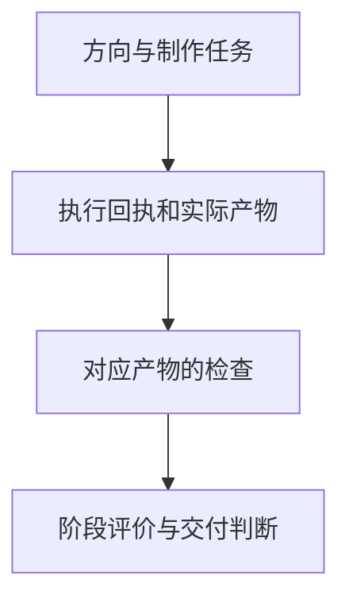

> **AI Craft 工程实践 · 第六篇。** 本文固定到 `7ff452e57b54d9bd18bc89518fba8523c9a8144a`。项目工作区另有未提交候选，本篇不使用这些候选新增的能力。护发案例为仓库中的虚构项目，评分不代表真实生成质量或广告效果。

仓库的虚构护发项目有一份 88.5 分的方向评价，同时明确记录 actual_output_observed 为 false。高分与“尚未观察实际产物”可以同时成立，因为它们回答的是不同问题。Creative Craft 需要把这层区别保留到制作和交付阶段。

我做 Creative Craft，希望把这些判断组织成可以推进的过程：先理解目标与约束，再形成真正不同的路线，选定艺术指导，准备制作，并根据实际看到的结果迭代。

它是面向概念、商业文案、艺术指导、图像与视频 Brief 的 Agent Skill。我主要负责创意方法、工作深度、产物关系和评价边界的设计，工程工具负责其中能够结构化检查的部分。[项目说明][readme]

## 日常创意与需要追踪的项目，工作深度不同

当前固定版本以 Quick Craft 为默认。用户要一句文案、一个概念或一段制作方向时，直接交付所需工作，不默认生成完整项目目录。

多资产、来源追踪或较复杂的协作确实需要记录时，再采用 Traceable Project。它增加品牌与参考快照、制作任务、执行回执、检查和交付记录。[工作深度][readme]

这个取舍也决定了产品形态：专业方法是主要能力，schema 和 CLI 为需要追踪的任务服务。一个结构完整的 JSON 无法自动成为好的广告概念；而一段短文案，也未必需要完整制作流水线。

## 什么才算不同的创意路线

仓库中的虚构护发项目提供了三条路线，可以具体说明“差异”在哪里：

| 路线 | 创意机制 | 需要检查的风险 |
| --- | --- | --- |
| Motion Is Proof | 用头发的自由运动表现轻盈与支撑之间的关系 | 观众是否只看到了漂亮动作，没理解产品主张 |
| The Quiet Lift | 用轻微上升的透明结构表达空气感 | 视觉隐喻是否遮住实际利益 |
| Before the Mirror Notices | 用日常清晨的自然瞬间表现结果 | 是否变成普通生活内容，缺少品牌与产品记忆 |

这些路线分别使用动作证明、视觉隐喻和纪实观察。它们对镜头、声音、文案和制作的要求也不同，不只是换颜色或构图。[虚构项目路线][routes]

路线记录还包含适合的资产形式、可行性、风险和否定条件。设计否定条件的目的，是提前说明什么观察会让我们放弃一个方向，避免选定之后只寻找支持它的理由。

不过，文件里写有“有辨识度”或“更容易理解”，仍然只是创意判断，需要后续作品与受众观察来检验。这个案例没有提供真实品牌投放结果。

## 品牌要求、外部参考与制作能力分别管理

Creative Craft 把三个容易混淆的输入分开。

品牌与产品要求进入私有 Brand Pack，明确主张、语言、资产与使用边界。外部案例进入 Reference Pack，记录观察、推断和可迁移原则；它不能覆盖主要品牌要求。模型与执行界面的能力则放在 provider 和 surface 资料中，保留时间与来源。[架构说明][architecture]

这样，模型能力变化可以更新对应资料，而不必重写创意方法。借鉴某个作品的表达原则，也不代表可以复制它的品牌、人物或素材。

在需要追踪的项目中，绑定品牌或参考会形成固定快照，避免外部目录悄悄变化后，项目还引用同一个版本名称。完整性记录帮助确定制作时使用了哪份要求，但不能代替素材授权本身的核实。

## 从方向到成品，中间还缺哪些事实

一条创意方向可以被整理成图像或视频任务，但任务文件只是制作输入。

固定版本的包负责准备和验证制作工作，不直接进行模型生成网络调用。执行由相应外部工具完成，因此应分别记录生成是否发生、产物是什么、检查了什么，以及最终是否采用。[执行边界][readme]

对于需要追踪的工作，可以沿下面这条关系理解：



这里每个关联都需要指向同一个对象。另一张图的检查结果，不能证明当前视频已经看过；同一任务的旧版本回执，也不能直接成为新产物的验收依据。

## 为什么 88.5 分仍然没有证明成品质量

虚构项目的评价文件记录了 `88.5` 分，同时明确：

- 阶段为 `direction`；
- `actual_output_observed` 为 `false`；
- 证据强度为 76%，置信度为 `MIXED`。

这些字段必须一起理解。88.5 是按照该虚构方向记录计算出的结构化评分，不是广告表现、模型排名或实际成品得分。100% 的证据覆盖也只表示各评价维度有相应状态记录，不能把其中的推断和假设全部解释为观察事实。[方向评价记录][evaluation-result]

已有测试进一步说明这个区别：当所有维度被标成 `HYPOTHESIZED`，覆盖仍然是 100%，但证据强度降到 40%，置信度变为 `WEAK`。当大量维度变成未验证且没有证据引用，评价器则暂不提供总分。[评价回归][evaluation-tests]

把覆盖、证据强度和分数分开，能减少“填满表格就等于验证充分”的误读。它仍然不能证明评分权重本身准确，这需要另外校准。

我的取舍是允许创意在制作之前被讨论和筛选，同时让评价阶段始终可见。如果选中的是 Motion Is Proof，下一步需要在实际制作中观察动作是否传达产品主张；当前方向分数无法预先回答这一点。每推进一个阶段，都应补充那个阶段才可能取得的事实。

## 一张图的检查不能被另一段视频借用

本篇最具体的工程案例来自 `test_output_gate_does_not_borrow_another_jobs_inspection`。

测试把评价阶段切到 output，目标设为某个视频任务，却只在项目记录里放入另一个图像任务的执行和检查链。评价结果必须是 `blocked`，`actual_output_observed` 仍然为 false。[产物匹配回归][evaluation-tests]

正向对照则给目标视频配上匹配的任务 ID、回执、产物 ID 和哈希，再记录对应检查。工具才允许该产物阶段的评价继续。

这项校验能阻止证据关联错误，却不能用一个 `approved` 字段证明成品实际优秀。人或模型作出的检查判断仍可能不准确，工具负责的是对象与记录关系。

## 本文怎样验证

为避免把工作区候选混入已提交版本，本次从固定 commit 导出一个仓库外临时副本，在该副本中运行：

```bash
PYTHONDONTWRITEBYTECODE=1 python3 -m unittest discover \
  -s tests -p test_evaluation.py -v
```

2026 年 9 月 13 日，15 项既有测试全部通过，涵盖阶段评价、证据强度、产物关联、部分时间与结构合同。没有调用图像或视频模型，没有生成新广告，也没有触碰原工作区的候选修改。

因此，本文能够解释评价工具如何处理这些 fixture；创意方法对真实输出的改善程度，仍需实际产物和适当对照。

## 当前限制与改进方向

首先，创意质量高度依赖 Brief。目标不清楚时，模型可能产生视觉上完整但主张薄弱的方向。后续需要评估它能否识别关键缺口，以及是否会在可合理推进时过度澄清。

其次，结构化评分可能偏爱容易描述和符合模板的作品。真正新颖的方向未必能立刻获得高分，也可能需要试拍才能理解。评价器需要保留不同意见和探索空间，不能把确定性计算误认为创意客观性。

第三，方向与实际制作之间仍有明显距离。生成工具对文字、物理行为、人物一致性和连续镜头的能力，要根据当时环境与真实产物判断。固定版本的包不承担模型执行，相关成功率不能由项目 schema 推导。

第四，追踪流程有使用成本。对复杂项目有价值的版本、来源和检查记录，放进简单需求里可能造成负担。因此需要持续检验 Quick Craft 与 Traceable Project 的路由是否适当。

## 自我改进需要保留创意多样性

本篇沿用 [Review Craft 专题中的对照与留出评测设计](/posts/ai-craft-02-review-craft-evidence-driven-review/#下一步实验让改进本身也能被验证)，下面只展开本领域的改进对象与特殊风险。

我希望先研究两类改进：Brief 缺口识别，以及让候选路线在创意机制上真正拉开差异。

实验应固定受众、目标和主要约束，在未见 Brief 上比较路线的可区分性、主张理解、可制作性和人工偏好。若只优化某个 Judge 的分数，系统可能学会写它喜欢的解释，而不是产生更好的创意。

因此，评价中应保留适当的盲评、不同判断者和实际产物检查；候选不能自行改写品牌要求或最终标准。需要同时观察是否出现表达趋同：分数提高，但不同任务最后都变成同一种视觉语言。

在这一层获得可靠结果后，再考虑让改进机制参与下一轮路线生成与失败分析。当前 RSI 是研究方向，没有运行持续自动创意进化实验，也没有把模型生成记录当成真实传播效果。

系列阅读：[系列总览](/posts/ai-craft-01-from-expertise-to-agent-capabilities/) · [上一篇：Design Craft](/posts/ai-craft-05-design-craft-authority-and-visual-evidence/) · [下一篇：Money Craft](/posts/ai-craft-07-money-craft-research-evidence/)

## 技术信息与来源

- 源码 revision：`7ff452e57b54d9bd18bc89518fba8523c9a8144a`。
- 本篇实测：固定提交导出副本中的 15 项评价相关回归通过。
- 虚构案例只用于说明方法与阶段；方向分数不代表成品或广告效果。
- 未覆盖：图像与视频生成、受众实验、真实品牌投放、未提交候选能力。

[readme]: https://github.com/bigKING67/creative-craft/blob/7ff452e57b54d9bd18bc89518fba8523c9a8144a/README.md
[architecture]: https://github.com/bigKING67/creative-craft/blob/7ff452e57b54d9bd18bc89518fba8523c9a8144a/docs/architecture.md
[routes]: https://github.com/bigKING67/creative-craft/blob/7ff452e57b54d9bd18bc89518fba8523c9a8144a/examples/premium-haircare-launch/concept-routes.json
[evaluation-result]: https://github.com/bigKING67/creative-craft/blob/7ff452e57b54d9bd18bc89518fba8523c9a8144a/examples/premium-haircare-launch/evaluation-result.md
[evaluation-tests]: https://github.com/bigKING67/creative-craft/blob/7ff452e57b54d9bd18bc89518fba8523c9a8144a/tests/test_evaluation.py
