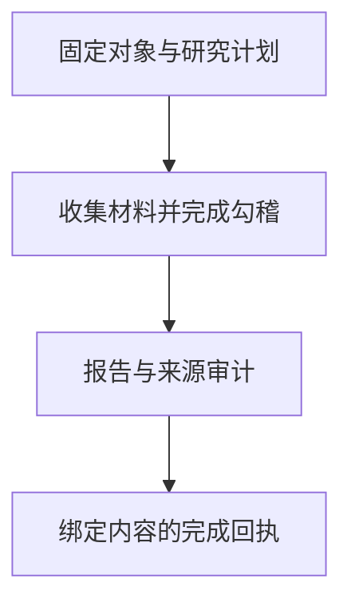

> **AI Craft 工程实践 · 第七篇。** 本文依据 `2d33799b939fab61fa842f0dfab420ed19239f19`，只讨论研究软件机制。数值与来源编号来自合成 fixture，不对应真实公司的财务判断或投资建议。未查询账户、执行交易或开展本文所述 RSI 实验。

研究报告通过检查以后，再修改正文，原来的完成回执还有效吗？Money Craft 的一项既有测试先生成回执，再改动 report.md，后续状态检查就会识别旧完成状态已经失效。这个小场景解释了我的一个设计重点：完成证明要对应具体内容。

Money Craft 是我围绕这些问题维护的研究工作流。它在 AI Berkshire 的相关底座上演进，把专业研究方法、数据获取和产物验证组织在同一个可移植 Skill 中，并保留上游来源边界。[项目说明][readme]

我的工程重点是固定研究对象与时间，分离来源和推断，并让报告的完成状态能够被核对。工具可以降低材料和计算中的一致性错误，最终投资判断仍然需要独立评估。

## 研究对象先成为一个明确合同

公司名称往往不足以唯一描述研究对象。同一家公司可能有不同市场的证券，财年也未必与自然年一致；估值使用的币种、财务报告期和数据截止时间，需要明确。

当前 `research plan` 会绑定证券身份、基础币种、研究时点、最新报告期与期末日期，并列出所需官方证据、可用数据操作、财务勾稽和产物要求。[研究计划合同][readme]

这一步不访问网络，也不创建已完成报告。它回答的是“这次研究应该收集和检查什么”。后续 init、collect、import、status 与 finalize 继续使用同一研究对象。

这样，某个数据适配器没有配置时，可以保留缺口；不能因为计划中存在操作项，就把相应数据写成已经采集。

## 数据适配器和官方披露承担不同职责

适配器可以方便地取得结构化数据，但来源、更新时间和字段口径仍然需要检查。核心研究合同把官方披露与市场数据操作分别管理，不把接口可用性当成研究结论的依据。[数据与研究边界][readme]

遇到重述、重大交易或期后变化时，研究还需要回到具体材料。一个成功响应说明这次接口请求得到结果，不能自动说明字段解释正确或资料足以支持当前主张。

在工程上，导入材料需要记录来源和内容身份；在分析上，则需要解释哪些内容是观察事实，哪些是基于这些事实的推断。哈希可以固定一份文件，却不能替代对其发行方、报告期和语义的判断。

## 财务勾稽为什么单独形成产物

研究中的数字不仅要可计算，还应在适用口径下相互对得上。Money Craft 使用 `financial-reconciliation.json` 记录比较期口径、来源、必要检查和待解释的差异。[财务勾稽实现][reconciliation]

仓库的合成 fixture 包含三类检查：

| 检查 | fixture 输入 | 需要确认的关系 |
| --- | --- | --- |
| 资产负债关系 | 资产 100、负债 40、权益 60 | 100 = 40 + 60 |
| 现金口径对齐 | 两处已对齐口径的期末现金均为 25 | 差额为零 |
| 累计值推单季 | 本期累计 80、前期累计 30、单季 50 | 80 − 30 = 50 |

这些是测试数字，不是公司财务数据。特别是现金检查，现实中不同报表口径可能存在受限现金等差异，应先明确口径与调节依据，不能为了让两边相等而改数。[合成审计案例][audit-tests]

测试随后把比较期基础改为未确认，同时把一处现金改为 20。审计既报告口径没有解决，也报告现金关系不匹配。两项问题分别保留，方便判断下一步应核对资料还是检查计算。

另一个负例删除原计划要求的单季检查，并引用不存在的 `S99`。校验会指出 required checks 与计划不一致，以及来源不在可用证据中。研究者不能通过删掉未通过的检查，让同一份计划悄悄变成“已经完成”。

## 调整后的比较值需要计算依据

重述和可比估计是另一个容易被语言掩盖的地方。“已经调整到可比口径”仍需要解释怎么调整。

当前测试要求 `comparable-estimate` 提供可复算的 calculation。缺少计算时不能通过；补上操作、输入、预期结果与容差后，才继续检查。[可比估计回归][audit-tests]

这保证了一部分计算可重复，但并没有证明调整在经济意义上合理。剔除某项成本是否适当、某笔收入是否可持续，仍然需要来源和分析判断。

因此，我把事实、计算和解释视为连续但不同的三个环节。把计算写清楚，可以让讨论集中到假设是否合理，而不是争论报告里的数字从哪里来。

## 从草稿到完成回执

研究运行把计划、来源、报告和审计组织在可恢复的工作区中。只有满足对应要求，finalize 才产生完成回执。



这里的回执是当前研究运行的完成证据，不等于自动进入独立的正式不可变发布档案；工作区与正式归档仍有各自流程。[研究与归档层级][readme]

`test_finalize_fails_closed_while_reconciliation_is_unverified` 创建合成研究工作区，准备报告和来源，却保留未验证的勾稽。finalize 必须失败，且不生成完成回执。[研究运行测试][run-tests]

正向测试在材料和勾稽齐备后生成回执，再修改 `report.md`。后续 status 会将旧完成状态判为失效。这说明回执绑定的是当时的内容，而不是“这个目录曾经成功过”。

这样的处理使更新有清楚含义：新材料或新观点进入报告后，需要重新完成受影响的检查。

这也体现了一项取舍：报告可以继续演进，但“曾经检查通过”不能沿用为所有后续版本的完成状态。保留内容身份和回执关联会增加检查成本，却让读者能够区分已经核对的版本与更新中的版本。至于新观点是否更好，仍然是另一项研究判断。

## 本文怎样验证

2026 年 9 月 13 日，我运行了既有审计模块的 14 项测试，以及两项研究完成回执测试，全部通过：

```bash
PYTHONDONTWRITEBYTECODE=1 python3 -m unittest discover \
  -s tests -p test_audits.py -v

PYTHONDONTWRITEBYTECODE=1 PYTHONPATH=tests python3 -m unittest -v \
  test_research_run.ResearchRunTests.test_finalize_binds_manifest_audits_and_receipt \
  test_research_run.ResearchRunTests.test_finalize_fails_closed_while_reconciliation_is_unverified
```

测试使用合成材料和模拟采集，不需要真实账户或行情。它们说明来源引用、计算、勾稽与回执的指定行为，不证明报告有预测能力，也不提供当前数据适配器的在线健康证明。

源码中关于缺口保留、来源导入和报告绑定的其他机制，本篇按固定版本解释，不把未运行的全部测试写成通过。

## 当前局限与改进顺序

第一，自动化审计无法代替资料阅读。来源编号存在，只能证明引用可解析；资料是否真正支持那个句子，需要进一步核对原文和上下文。

第二，财务关系的有效性取决于口径。币种、单位、重述和报表定义如果输入错误，算术再精确也会得出错误解释。后续应优先增强口径缺口的呈现，而不是增加看似完整的估值输出。

第三，报告完整性与投资判断质量不同。结构齐全、计算正确，仍可能忽略竞争变化、管理层行为或估值假设中的关键风险。评价需要结合独立研究判断，不能只看模板覆盖率。

第四，数据与披露会随时间变化。完成回执说明某个时点的内容通过检查，不能永久担保观点适用。后续更新需要保留新旧事实和判断变化的原因。

## 自我改进应避免用未来答案改写过去

本篇沿用 [Review Craft 专题中的对照与留出评测设计](/posts/ai-craft-02-review-craft-evidence-driven-review/#下一步实验让改进本身也能被验证)，下面只展开本领域的改进对象与特殊风险。

我计划优先研究证据缺口识别、资料需求规划和财务异常解释。Agent 可以根据已确认的问题提出规则或工具改进，再在未见研究任务中检查是否减少遗漏。

这种评测要特别处理时间：评估某个历史时点的研究能力时，只能使用当时可获得的材料。后来的财报或价格不应悄悄进入输入，再被称为当时的判断能力。

衡量候选时，可以观察未支持主张的比例、引用有效性、口径问题、勾稽错误和研究成本。短期收益率会受到多种因素影响，不适合作为这里唯一的优化目标。

最终评测和研究对象合同应保持独立，候选不能通过删除必需检查或降低来源要求来获得更高完成率。若第一阶段有稳定收益，再研究改进后的证据规划机制能否帮助下一轮迭代。

这条 RSI 路线仍是计划。它服务于研究方法的可靠性，不包含自动交易或账户操作。

系列阅读：[系列总览](/posts/ai-craft-01-from-expertise-to-agent-capabilities/) · [上一篇：Creative Craft](/posts/ai-craft-06-creative-craft-direction-and-output/) · [下一篇：Reverse Craft](/posts/ai-craft-08-reverse-craft-reproducible-evidence/)

## 技术信息与来源

- 源码 revision：`2d33799b939fab61fa842f0dfab420ed19239f19`。
- 本篇实测：14 项审计测试和 2 项研究回执测试通过。
- 数值与来源编号均为合成 fixture；没有真实证券结论或经营数据。
- 未覆盖：在线适配器现状、真实研究效果、正式报告发布和 RSI 实验。

[readme]: https://github.com/bigKING67/money-craft/blob/2d33799b939fab61fa842f0dfab420ed19239f19/README.md
[reconciliation]: https://github.com/bigKING67/money-craft/blob/2d33799b939fab61fa842f0dfab420ed19239f19/skills/money-craft/scripts/financial_reconciliation.py
[audit-tests]: https://github.com/bigKING67/money-craft/blob/2d33799b939fab61fa842f0dfab420ed19239f19/tests/test_audits.py
[run-tests]: https://github.com/bigKING67/money-craft/blob/2d33799b939fab61fa842f0dfab420ed19239f19/tests/test_research_run.py
