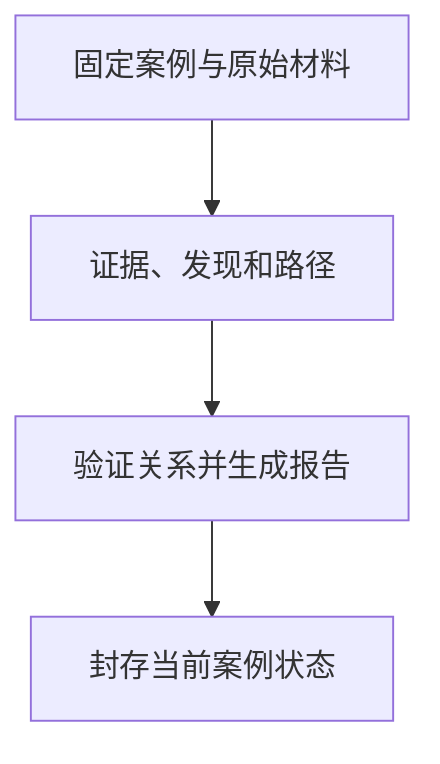

> **AI Craft 工程实践 · 第八篇。** 本文依据 `f2f7aa22656391c64eb5d8cc0ace89cfc0471ea2`。案例来自仓库中的无害合成字节和测试记录，不涉及真实攻击目标、恶意样本分析或漏洞利用。自我改进部分为未来研究设计。

如果删除事件记录的最后一项，剩下的哈希链仍然前后相接，校验就应该通过吗？Reverse Craft 的一个既有测试专门制造了这种情况：截断后的记录还要与事件计数、尾部锚点和案例快照核对。只检查链条内部，会漏掉“本来应该还有一项”这件事。

对于逆向工程和取证，这个问题需要从研究开始就考虑：对象是不是同一份文件，工具有没有改动原件，哪些内容是观察，哪些只是解释，最终报告引用的记录是否仍然完整。

Reverse Craft 是我把这类方法组织成 Agent Skill 的实践。它提供专业路由、案例记录、证据关联、报告与封存工具；我的工程重点是保持研究对象和推理依据可追溯，并让不同研究路线共享必要的记录机制。[项目说明][readme]

## 专业路由与案例记录分别解决问题

当前项目用一个可发现入口组织多条专业路线，覆盖二进制、Web、移动端、取证和公开来源研究等方向。专业模块帮助选择研究方法，案例 runtime 则保存对象、证据与结论关系。

路线数量不等于每条路线都具备同样的实战成熟度，也不代表 Agent 可以自动完成任意目标。工具是否可用、对象是否支持当前方法，都要在实际任务中确认。

对于 JavaScript 和浏览器研究，Reverse Craft 复用 browser67 的 `js-reverse` 运行时，不复制另一套浏览器会话和标签页状态。[运行时边界][agents]

这种分工使专业方法能够演进，同时避免多个模块分别描述同一个浏览器目标。

## 先固定研究对象

在默认证据导入流程中，工具读取来源文件的大小与哈希，将其复制到案例 artifact store，再检查副本是否与读取到的原件一致。来源、采集方式、观察时间和内容身份进入证据记录。[证据导入实现][store]

这使后续分析可以围绕已保存的副本进行，原件与派生物保留不同路径。若明确使用外部引用，后续仍要检查所引用文件有没有变化。

副本一致性解决的是“讨论哪一份对象”。它不能证明来源描述真实、文件由谁创建或样本具有何种行为；这些都需要额外的获取记录和研究证据。

## Evidence、Finding 与 Path 怎样关联

案例中有三类核心记录：

| 记录 | 主要职责 | 示例含义 |
| --- | --- | --- |
| Evidence | 保存可检查的材料 | 文件、工具输出或观察记录 |
| Finding | 表达基于材料形成的判断 | 一个行为或条件是否得到支持 |
| Path | 组织多个发现之间的研究路径 | 从输入到某个结果的解释链 |

报告把这些关系展开，便于读者回到具体依据。状态和置信度需要保留，不把所有候选都写成已经确认的发现。

测试中的 confirmed finding 要引用已知证据；引用 `E-9999` 或缺少必要证据会被拒绝。Path 引用未知 finding，或把已被驳回的发现用于受支持路径，也会失败。[案例关联回归][tests]

这是一项关系校验。给一个 finding 填上 `confirmed`，并不意味着 runtime 已经独立复现了它描述的行为。结论的语义有效性仍然需要研究者与适当工具来证明。

## 一个无害 fixture 怎样走完生命周期

仓库测试创建一个只包含固定字节的 `sample.bin`，随后建立案例、导入证据、加入说明性发现与路径、生成报告，最后封存。



`test_full_lifecycle_and_seal` 检查这套流程能够形成报告与 seal，并确认封存后的案例不再接受普通追加证据操作。[完整生命周期回归][tests]

这个测试没有对字节执行逆向分析。说明性发现由 fixture 创建，验证对象是案例工具的行为，而非某个研究任务的成功率。

这一区分使复现具有明确范围：读者可以重跑记录、验证和封存过程，但不能把测试中的说明文字解释为已发现真实漏洞。

## 为什么事件链还需要快照与尾部锚点

案例将动作写入事件流，记录序号、时间、类型、数据、前一项哈希和当前事件哈希。验证时重新计算内容，并检查顺序与前后关联。[事件校验实现][validation]

修改事件数据后，`test_tampered_event_chain_is_detected` 要求校验报告哈希不匹配。这个案例容易理解，但仅检查链内关联还不够：删除最后一个事件，剩下的前缀仍可能内部自洽。

因此另一个测试会截断事件尾部，再检查案例中的事件计数、尾部锚点以及路径快照是否与事件流一致。结果必须失败，而且在不一致被处理之前，不允许继续追加证据。[事件截断回归][tests]

这里值得关注的是多份记录之间的相互约束。事件流说明发生了哪些动作，快照说明当前对象集合，尾部锚点说明预期走到了哪里。它们需要对得上，不能只验证一个 JSON 是否能够读取。

我的取舍是保留用途不同的记录，并承担它们之间的一致性检查。事件流适合回看过程，快照适合读取当前状态，尾部锚点提供预期终点。它们的价值来自互相核对，因此并发写入、失败恢复和协议演进也必须考虑这些关系。

即便如此，如果攻击者能够同时重写所有文件、所有哈希和 seal，又没有独立保存的可信锚点，本地哈希链并不提供外部真实性保证。本文将它称为完整性校验机制，不将其描述为不可伪造的第三方存证。

## 封存到底固定了什么

`seal_case` 在锁内检查案例仍然开放、事件流可继续且当前校验通过，然后记录封存事件、生成 manifest 与 seal，最后再验证一次封存状态。[封存实现][store]

封存固定的是这一组文件与逻辑状态。它有助于后续发现内容变化，也让一次研究产物形成明确结束点。

但封存不能提高结论的置信度。一个有证据缺口的研究，不会因为生成 seal 就变成已确认事实。报告仍然应保留观察、推断、待验证假设与适用边界；需要后续研究时，也不能静默修改已经封存的版本。

## 本文怎样验证

2026 年 9 月 13 日，在固定源码下执行以下命令，24 项既有案例存储测试全部通过：

```bash
PYTHONDONTWRITEBYTECODE=1 python3 -m unittest discover \
  -s tests -p test_case_store.py -v
```

这组测试还覆盖文件变化、非法引用、报告路径保护、并发证据编号和若干损坏输入。它们使用临时目录与合成对象，没有访问外部目标，也没有启动真实宿主研究。

因此，本文证明的是指定案例管理机制的本地行为。真实二进制、移动端或浏览器路线的研究效果，需要分别提供对象、工具、步骤和独立复现结果。

## 当前局限与改进方向

首先，证据链完整不等于推理链正确。错误的实验设计、对工具输出的误读，以及未考虑的替代解释，都可能存在于结构完整的案例中。后续评价必须把“材料可追溯”和“结论可复现”分别检查。

其次，研究环境本身可能影响结果。操作系统、工具版本、依赖与目标状态都可能改变行为。文件哈希固定了对象，却无法独自固定整个环境；真实案例需要补足关键运行条件。

第三，专业路线的可行性需要动态判断。某个方法无法推进时，应记录失败原因并调整假设或工具，而不是重复同一动作。本文没有证明所有路线都已经具备持续自动重规划能力。

第四，封存和验证工具需要维护协议兼容、并发与错误恢复。当前回归为这些边界提供部分证据，但不能把测试数量解释成对所有崩溃与存储故障的完整覆盖。

## 自我改进应围绕可证伪的假设

本篇沿用 [Review Craft 专题中的对照与留出评测设计](/posts/ai-craft-02-review-craft-evidence-driven-review/#下一步实验让改进本身也能被验证)，下面只展开本领域的改进对象与特殊风险。

我希望先研究失败分类与路线选择：Agent 能否根据已确认的失败判断应该补环境、换观察方法，还是重新定义假设。

实验应使用范围明确的离线 fixture 或受控挑战，让候选修改研究指导与辅助工具，再在未见样本上比较有效假设、成功复现、无依据结论和成本。任务对象与授权范围保持固定，不能以扩大访问或修改目标来换取表面成功率。

尤其需要避免一种偏差：更长的报告、更完整的事件记录，可能提高形式上的完成度，却没有增加研究发现。评价应优先看结论是否经得住独立复现和反例检查。

在受控改进确实有效以后，再探索改进后的诊断与假设生成机制能否帮助下一轮研究。这是 RSI 的可能方向；当前没有让案例自动生成漏洞结论，也没有启动开放目标上的自我演化。

对我来说，值得保留的研究能力，是另一位研究者能够拿着同一份材料，理解判断依据，并检查它是否成立。

系列阅读：[系列总览](/posts/ai-craft-01-from-expertise-to-agent-capabilities/) · [上一篇：Money Craft](/posts/ai-craft-07-money-craft-research-evidence/)

## 技术信息与来源

- 源码 revision：`f2f7aa22656391c64eb5d8cc0ace89cfc0471ea2`。
- 本篇实测：24 项 case-store 回归通过，对象为临时合成 fixture。
- 没有真实攻击、敏感样本或未授权目标；未运行真实宿主和 browser67 研究 gate。
- 哈希、事件链和 seal 提供本地完整性约束，不证明来源真实性或结论正确性。

[readme]: https://github.com/bigKING67/reverse-craft/blob/f2f7aa22656391c64eb5d8cc0ace89cfc0471ea2/README.md
[agents]: https://github.com/bigKING67/reverse-craft/blob/f2f7aa22656391c64eb5d8cc0ace89cfc0471ea2/AGENTS.md
[store]: https://github.com/bigKING67/reverse-craft/blob/f2f7aa22656391c64eb5d8cc0ace89cfc0471ea2/skills/reverse-craft/lib/reverse_craft/case_store.py
[validation]: https://github.com/bigKING67/reverse-craft/blob/f2f7aa22656391c64eb5d8cc0ace89cfc0471ea2/skills/reverse-craft/lib/reverse_craft/case_validation.py
[tests]: https://github.com/bigKING67/reverse-craft/blob/f2f7aa22656391c64eb5d8cc0ace89cfc0471ea2/tests/test_case_store.py
