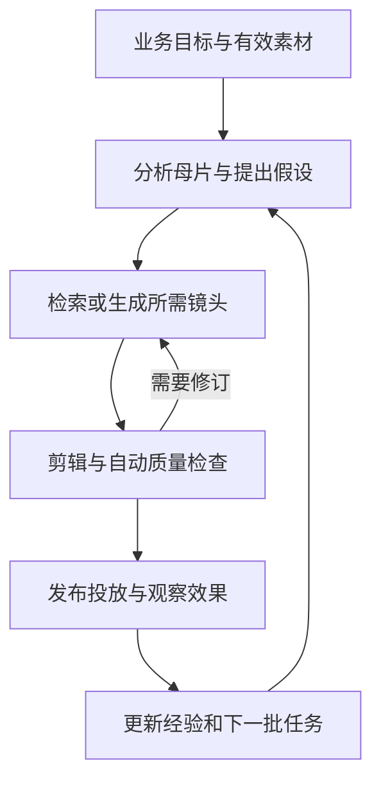
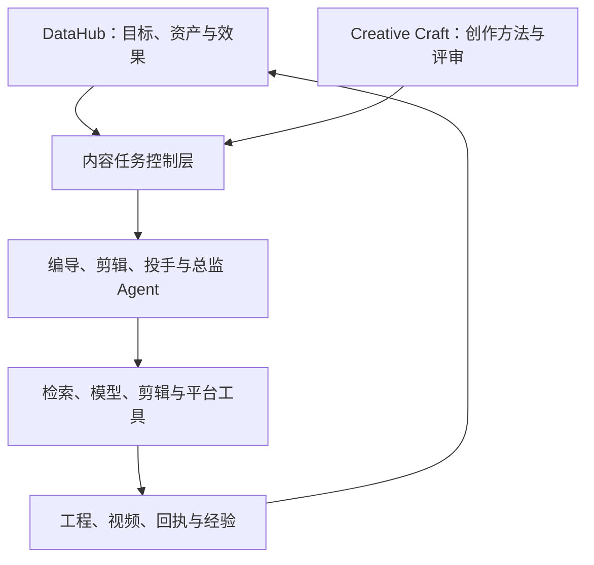

> **「从 DataHub 到 AI Hub」系列**记录我如何从真实业务出发，让数据成为可信的事实，再让系统能够基于事实判断、行动和学习。[上一篇](/posts/from-datahub-to-ai-hub-01-datahub-foundation/)写的是数据底座。这一篇，写我正在建设的内容生产能力。
>
> 本文是一份工程设计与阶段记录。截至 2026 年 9 月，部分能力已有本地实现和验证，完整自主生产仍是建设目标。文中的产能数字是设计基准，案例是匿名示例，不是实际投放成绩。

我最想解决的需求很具体：**把一条表现不错的千川视频，持续变成更多值得测试的新视频。**

做过短视频投放就会知道，这件事远不止裁切、换字幕、改音乐。为什么这条视频有效？是开头击中了某种处境，还是商品证据更有说服力？哪些部分应该保留，哪些可以改变？素材库里有没有支撑新表达的镜头？剪出来之后，谁判断它是不是能用？投出去之后，又怎么知道这次修改有没有价值？

这些问题分别落在编导、剪辑、投手和内容总监身上，最后靠人把它们串起来。

一个编导每天能认真看完、拆解和创作的视频有限，一个剪辑能完成的版本也有限。我想把他们的思考框架、经验和执行方法变成系统能力，让 Agent 能够持续工作。人逐步减少日常生产中的操作和关注，把时间放在新方向和创造上；当系统足够成熟，具体的生产任务也可以完全交给它。

所以，我对内容中台的期待已经从“管好素材”，走到了“承担生产”。

## 从一条爆款，走到一个完整的生产闭环

假设有一条介绍日常用品的视频表现不错。它先展示使用中的麻烦，再演示解决办法，最后给出行动提示。

我希望系统先检查这条视频适合承接什么目标：吸引用户进入直播间，还是直接购买商品。这两类任务需要的上下文不同，评价标准也不同。直播内容、商品事实、活动有效期、允许使用的素材，都应该先进入任务。

接着，Agent 拆解母片，提出可验证的新方向。例如把使用场景放在开头，把产品证据提前，或者换一种更明确的问题表达。每个方向都要说明“为什么这样改”，并找到对应素材，而不是凭空写一份无法拍、无法剪的脚本。

如果缺镜头，系统可以检索其他素材、补充生成，或者放弃这个方向。剪辑完成后，还要检查口播是否被截断、字幕是否错位、商品是否一致、结尾是否匹配承接页面。通过检查的版本进入实验，效果成熟后再决定继续、修改还是淘汰。

这里的“裂变”必须保留创作目的。仅仅换个标题、镜像一下画面，虽然可以产生不同文件，却不一定产生新的表达，更不能证明增加了商业价值。

我也不希望系统为了凑数量，把缺素材、检查失败和人工救回的任务藏起来。目标是一百条，最终只有八十条可用，就应该如实记录八十条，以及另外二十条为什么没有完成。

## 四个角色，要变成四种能交付的能力

给模型起一个“资深编导”的名字很容易，难的是让它拥有上下文、工具、判断标准和交付责任。

编导要把业务目标变成有依据的创意假设、脚本和分镜；剪辑要把分镜变成可重复生成的实际视频；投手要把版本放进有边界的实验，识别哪些数据已经成熟；内容总监要安排方向和资源，决定继续生产什么、淘汰什么，以及哪些经验值得保留。

我会在这四种业务能力之外，拆出素材研究和质量检查。它们可以由独立 Agent 承担，也可以作为其他角色调用的能力，但输入输出要明确。

角色之间传递的是带来源和版本的工作成果。例如编导交给剪辑的是一份可执行方案，包含片段引用、表达顺序、声音与字幕要求；剪辑交回工程版本和成片；质检指出具体时间点和问题；投手返回带时间窗口、口径和不确定性的观察结果。

这样，出错时才能找到责任环节。两个 Agent 同时修改一个工程，也要通过版本检查解决冲突，而不是最后写入的答案覆盖前面的工作。

我希望人的参与逐步退出，但这不意味着系统可以没有边界。目标、素材使用条件、预算和外部账户授权，都是任务本身的组成部分。成熟后的日常生产不应该每条都等人点击确认；超出任务边界时，系统则需要暂停相应动作、说明原因，并保留已经完成的工作。

## DataHub 与 Creative Craft，各自负责什么

DataHub 已经在积累业务事实。对于内容生产，它需要继续保存资产、片段、项目、工程版本、任务状态、平台素材关联和效果数据。

Creative Craft 提供的是创作方法：如何理解 Brief，如何形成概念，如何组织叙事，如何评审表达，以及把方案交给制作工具时需要什么信息。它帮助 Agent 学会怎样做判断，也承载可复用的制作能力。

两者之间的边界很重要。某个商品的事实、某个账户的预算和某条视频的投放结果，属于业务系统；通用的创意方法和制作协议，可以沉淀到 Creative Craft。这样，方法可以复用，业务数据也有明确归属。

落到技术上，我计划沿用 DataHub 的 Rust 服务管理身份、业务状态、权限和事务；Python Worker 承担素材分析、模型调用和媒体执行；PostgreSQL 保存结构化事实与任务记录，对象存储保存媒体，向量检索与文本检索共同定位素材。

内容运行时服务于这条业务链。它需要自主判断与多角色协作，但不必重新建设一套通用聊天、私人记忆和个人 Agent 管理产品。

## 真正困难的，是让 Agent 的工作可靠地发生

这套系统需要几份稳定的工程合同。

第一份是任务合同。一次生产要有持久的目标、计划、步骤、尝试和结果。模型可以提出下一步行动，但任务是否完成，要由真实工具结果和检查决定。一个 Agent 说“视频已生成”，不能代替文件、媒体检查和产物摘要。

任务还需要在进程退出后恢复。特别是请求已经发给模型或平台、响应却超时的时候，系统必须先查询和对账。直接重发可能生成两次，也可能花两次钱。取消任务同样不能假装已经撤销外部平台接受的动作。

第二份是素材合同。资产要能追溯来源，片段要带时间范围，标签和分析要保留模型与版本。检索需要组合字幕、画面文字、图像、时间顺序和业务标签，才能回答“找到演示某个功能的镜头”，而不只是找到文件名相似的视频。

全量历史素材索引也在完整方案里。我会用可恢复的清单记录哪些已经处理、哪些失败、哪些没有使用条件，后续新增和变更继续增量更新。处理进度必须能对账，不能把失败素材悄悄从总数里拿掉。

第三份是剪辑工程合同。Agent 最终应该交出可编辑、可重渲染的工程，而不只是一个 MP4。多轨、B-roll、字幕、配音、音乐、转场、变速和品牌包装，都需要统一描述。

例如，源片段的第 10—14 秒以两倍速使用，成片里只有两秒；原本第 11—12 秒的字幕，也必须映射到新的时间位置。字幕、声音和画面如果各自处理，很容易得到“文件能播放，内容却不对”的结果。

我因此选择统一的编辑文档，再把它编译给不同引擎。FFmpeg 处理基础媒体任务，其他引擎承担各自擅长的模板、动效与程序化视频。能力不支持时，要明确拒绝或重新规划，不能静默丢掉一条轨道。

第四份是评价合同。媒体有效、内容正确、创意有差异、经营结果好，是不同层次。检查器可以发现错字、断句和来源问题；真实商业效果仍然需要实验与时间。历史爆款只说明它值得研究，并不能证明其中每一个镜头都有因果作用。

## 从七个项目里，吸收不同的工程经验

在研究制作链路时，我把七个项目纳入了 Creative Craft 的工程参考。它们解决的问题各有侧重，也让我能把创作方法、剪辑交互和执行引擎分开思考。

| 参考项目 | 对这套系统的启发 |
| --- | --- |
| [HyperFrames](https://github.com/heygen-com/hyperframes) | HTML 场景与视频制作之间的工程组织，作为一种渲染能力研究 |
| [ChatCut Agent Plugin](https://github.com/ChatCut-Inc/agent-plugin) | Agent 怎样使用剪辑工具，以及方法如何进入执行流程 |
| [OpenChatCut](https://github.com/0xsline/OpenChatCut) | 素材理解、规划与剪辑交互如何连起来 |
| [OpenMontage](https://github.com/calesthio/OpenMontage) | 自动组织素材与制作流程的系统拆分 |
| [Remotion](https://github.com/remotion-dev/remotion) | 用程序表达可复用的视频模板和动效 |
| [Cerul](https://github.com/cerul-ai/cerul) | 视频理解、检索与创作上下文之间的衔接 |
| [OpenCut](https://github.com/OpenCut-app/OpenCut) | 编辑器中的时间线、项目结构和人工精修体验 |

上表表达的是我的吸收方向，具体实现以研究文档中的固定源码版本为基线，不声称覆盖项目的最新能力。引入实际依赖之前，还需要核对选定版本的许可证、部署方式、成本和接口。

最终应当由自己的任务与编辑合同组织这些能力。不能因为参考项目很多，就让用户面对多套不兼容的工程文件，也不能默认把整套上游应用塞进 DataHub。

## 日产一千条，要按生产系统计算

我给完整方案设定的容量基准是每天一千个候选：七百条复剪、两百条实拍加生成混剪、一百条完整生成。三条路线都在目标里，完整生成并没有从方案中移除。

按平均四十五秒计算，每天成片总时长是十二点五小时。假设混剪中有百分之二十的生成镜头，那么最终入选的生成镜头就有六千三百秒。实际付费量还要加上候选、失败、重试和修订。

所以，“Agent 一天能剪很多条”只是起点。还需要知道实际渲染多久、模型额度是否足够、素材下载是否成为瓶颈、废片占比多少、每条可用视频到底花了多少钱。只统计成功的视频、忽略失败成本，会得到非常漂亮但无用的数字。

我会把模型调用、渲染、索引和平台操作分成独立队列，让它们有各自的并发和配额。付费前原子预留预算，执行后结算，结果未知时保留对账状态。多个 Agent 并行工作，也不能各自看到同一笔余额后同时花掉它。

千条产能还必须和质量一起验收。一天输出一千个视频文件，与一天交付一千条可用内容，是两件需要分别计数的事情。

## 现在走到了哪里，接下来怎么走

截至本文写作时，本地工作区已经出现了从资产走向制作的链路。部分新能力仍处于未提交状态，我不会把它们写成已经发布的产品。

| 层次 | 当前能够确认的范围 |
| --- | --- |
| 资产与业务事实 | 已有资产管理、平台素材关联、数据导入与分析基础 |
| 本地制作 | 已有项目与版本、顺序时间线、片段检索和规划、镜头目录及语义任务等局部实现 |
| 实际视频产物 | 本地验收产生过可播放 MP4，并核对过产物摘要；对象服务采用本地测试夹具，部分模型响应为模拟数据 |
| 完整生产系统 | 多轨专业制作、持续自主协作、多引擎统一工程、全生成和平台闭环仍需按完整规格建设 |
| 真实经营效果 | 本文没有提供生产部署、日千条容量或投放增益的验证结论 |

我已经把后续工作拆成六份工程规格：产品与验收、架构与 Agent 运行协议、数据与剪辑工程、检索模型与学习、容量成本与运维、实施与验证。

实施顺序先解决身份、资产和持久任务，让系统知道自己在为谁做什么；再打通全量理解、专业制作、多引擎和生成；接着接入质量、平台实验与效果回流；最后用连续运行、预算对账和故障恢复证明它能够承担生产。检索、编辑器与模型适配可以在共同合同明确后并行推进。

微调也在方案里，但它需要从真实问题出发：先积累有来源的样本和反例，隔离训练集与评测集，再判断候选模型是否改善了具体任务。训练链路可以建设，训练出的模型是否进入生产，则由冻结评测决定。没有收益就保留原有基线。

这些阶段描述的是依赖顺序。完整目标始终包括专业剪辑、多 Agent、历史索引、生成、模型优化与平台自动执行；每一部分都需要可检查的交付和验收。

我也不再想用一个接近满分的数字评价整个项目。方案是否完整、代码是否实现、真实能力是否通过、系统是否稳定运行、经营结果是否成立，需要分别回答。把它们合成一个“落地成功率”，只会掩盖最重要的未知。

## 最终，我希望人不再是每个环节的连接器

更成熟的系统会持续观察素材、目标和效果，自己提出新方向，安排制作，检查产物，发起允许范围内的实验，并根据结果更新下一批任务。

它保存的不只是“哪条视频好”，还包括为什么尝试、适用于什么条件、看到了什么证据、哪里出现反例。经验可以被修正和失效，而不是一句被反复引用的成功秘诀。

这时，内容总监不必每天追问几十个任务进度，剪辑不必反复做同一种操作，编导也可以从大量机械检索和版本制作中脱身。系统若能稳定承担一个岗位中的完整任务，这部分工作就有机会真正被替代。

我希望自己最终面对的是一个能持续交付的生产系统：给它一个清楚的目标，它能够组织工作、形成作品、面对结果，再做出下一次判断。人的注意力可以逐步离开常规生产，去寻找还没有被定义的问题和新的创造方向。
