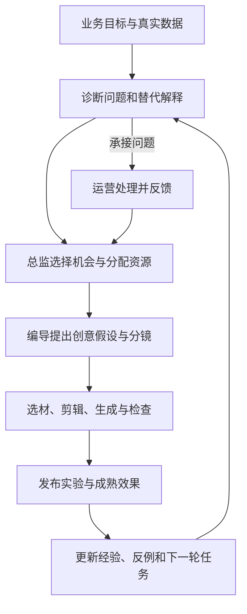
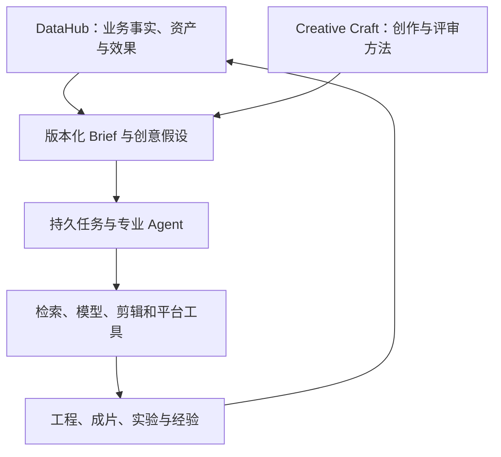

> 本文是截至 2026 年 9 月的工程设计与阶段记录。部分能力已有本地实现和验收记录，完整自主生产仍在建设中。下文案例用于解释工作方式，产能数字是设计基准，均不代表实际投放成绩。

我最想解决的需求很具体：**把一条表现不错的千川视频，持续变成更多值得测试的新视频。**

这件事看起来像剪辑任务，真正做起来，却会牵出一串问题：原片为什么有效？哪些表达值得保留？应该换开头、前移证明，还是换一个使用场景？素材库里有没有合适的片段？新版本投出去以后，怎么判断这次修改有没有价值？

编导、剪辑、投手和内容总监每天都在回答其中一部分，最后靠人把它们串起来。一个编导能认真看完和拆解的视频有限，一个剪辑能完成的版本有限，团队能同时验证的方向也有限。

我想把这些岗位的思考框架、经验和执行方法变成系统能力。Agent 能持续整理素材、理解内容、提出方向、完成制作，再面对实际结果。人逐步减少常规操作和关注，把更多时间放在新方向与创造上；当系统能够稳定承担完整任务，这部分工作也就有机会被替代。

我曾用“内容中台”描述它。这个名字能说明资产整合与公共能力复用，却没有充分表达我想交给系统的工作：根据目标判断下一步，调用工具完成生产，再根据结果调整行动。因此，我更愿意把它称为**内容自主生产系统**。素材管理、检索和分析仍然重要，它们共同支撑 Agent 承担完整任务。

但要走到这里，首先得回答一个问题：**数据到底在哪里参与了生产？**

## 数据要影响下一条视频，而不只是解释上一条

DataHub 已经在组织资产、平台素材关联和效果数据。我最初的设计更多围绕素材管理、AI 分析、检索和制作展开。继续往下推，才发现即使这些模块都存在，也可能各做各的：分析生成一份报告，剪辑收到一句“再做几个版本”，真正的判断仍然留在人脑里。

我需要补上的，是从分析到行动之间的关系。

一个素材库除了知道“这里有一段产品演示”，还应该知道它出现在哪些成片中、服务过什么目标、面对什么受众、表现如何，以及这些表现究竟能说明多少问题。编导提出新方案时，应该读到相关事实；剪辑选择片段时，应该知道它承担什么叙事作用；投手收到成片时，应该知道这次准备验证什么。

数据因此要进入三个位置：生产前帮助确定机会，生产中帮助选择表达和素材，生产后检验判断并修正经验。

这也意味着，系统不能只挑 ROI 最高的视频来拆，也不能只复制播放量最高的开头。受众、价格、投放方式、时间和承接都会影响结果。比较之前，先要弄清楚是否在讨论同一类任务。

## 引流直播间与挂车成交，不能共用一套判断

同一段视频，用来引导进房和用来直接卖货，可能需要不同的开头、证明和结尾。

直播引流要让适合的人愿意进入直播间，并让视频里的承诺与当场货盘、活动和主播表达相匹配。挂车短视频则需要在有限时间里完成商品理解、信任建立和购买引导，后续还要考虑退款与结算。

自然内容也纳入同一套系统，但目标可以是相关受众关注、搜索需求、信任建设或引导行动。自然发布同样可以引流直播间、促成成交，因此业务目标与流量来源需要分开记录。

| 场景 | 优先回答的问题 | 需要一起看的条件 |
| --- | --- | --- |
| 直播引流 | 是否带来了成本合理、符合目标的进房用户？ | 真实进房数据、可关联的后续行为，以及当场直播承接 |
| 挂车成交 | 是否获得了符合经营要求的成交？ | 点击后支付、归因窗口、退款结算、价格、库存与商品页 |
| 自然内容 | 是否完成了这次内容任务的目标？ | 相关人群、关注或搜索等可得行为，以及后续价值 |

这里有些区分很具体：点击不一定是进房，支付投产不等于净成交投产，净成交投产也不等于利润。账户一天的直播成交，可以帮助判断整体承接，却不能直接分摊成某条视频、某个镜头的贡献。

拿不到细粒度数据时，系统就停留在能够证明的层次。缺失不填成零，尚未成熟的成交不提前宣布为赢家，全域汇总也不能再加一次已经包含在其中的分项。

这些约束会影响 Agent 的实际动作：它现在能继续观察、可以提出复剪假设，还是已经有足够依据调整投入。

## 我用“创意假设”把各个角色连起来

我希望各角色围绕同一个可验证的问题协作。这个共同的工作单元，就是创意假设。

它要说清楚：面向谁，想解决什么问题，依据是什么，准备改变什么、保留什么，希望影响哪个指标，以及什么结果会让我们放弃这个判断。

用一个挂车场景来说明。假设某条视频的商品点击不错，但支付转化偏弱。这是设计示例，并非本项目已经验证的结果。

分析 Agent 先检查数据是否成熟，再排查价格、库存、商品页和受众变化。它不能看到转化低，就直接要求剪辑重做。假如内容里存在“主张很强，但真实演示出现较晚”的问题，才把“证明前移可能帮助转化”列为待验证解释。

内容总监把这个机会与其他任务比较。如果承接正常、素材齐全、验证成本合理，就给它分配生产和测试资源。若实际问题是商品页故障，则转给运营处理，相关实验等待恢复。

编导把假设变成脚本：保留已经吸引用户的开头，把真实演示前移，压缩重复介绍。每个分镜要说明它是在吸引注意、解释问题、提供证明，还是引导行动。

剪辑 Agent 据此寻找片段，检查产品、动作和声音能否连贯，再生成独立版本。它需要保留这次实验要求不变的部分，避免顺手把价格、口播、音乐和结尾都改掉，最后无法解释变化。

投手 Agent 在实际账户能力允许的条件下组织比较，观察支付、退款和其他约束。如果结果只是点击更高、退款也更高，就不能只拿点击改善来宣告成功。

最后，总监决定复用、继续验证或停止，系统记录适用条件和反例。沉淀下来的经验应当是“这个商品面向这类受众时，前移这种证明可能有效”，而不是“所有视频都要把演示放在第三秒”。

换成直播引流，判断可能完全不同：视频已经带来适合的用户，问题却出在直播间没有及时展示对应商品。这时再生产一百条视频，也未必能解决问题。统一协调的意义，就在于系统知道什么时候该改内容，什么时候该处理承接。

## 数据可以帮助选片，但不能替片段编造功劳

根据效果挑选素材和片段是合理的，也是我接下来要打通的重点。但整片表现与片段贡献之间，还有一段距离。

一条高 ROI 视频里出现了某个演示镜头，只能说明它值得研究。这个镜头可能有效，也可能只是碰巧出现在一个受众精准、价格合适的广告中。反过来，一条整体表现不好的视频，也可能包含适合另一种表达的片段。

我把表现证据分成三个层次：

| 证据 | 可以帮助做什么 | 还不能证明什么 |
| --- | --- | --- |
| 整片关联 | 从表现较好的成片中寻找候选表达和片段 | 其中每个片段都有效 |
| 时间段行为 | 将观看、点击等变化与台词、画面和 CTA 对齐 | 某个位置的变化一定由该镜头造成 |
| 受控比较 | 在明确条件下比较替换片段或结构后的结果 | 结论可以无条件迁移到所有商品和受众 |

例如，某个时间点观看人数下降，未必代表内容失败；用户也可能在这里完成了点击。只有时间曲线而没有行为上下文，很容易让 Agent 得出相反的结论。

因此，选材先看这段内容是否有权使用、是否符合商品事实，再看它能否完成当前分镜的作用、是否与前后文连续，最后参考可比的表现证据。没有历史数据的新素材，也需要有受约束的探索机会，否则系统只会不断重复已有赢家。

TikTok 的 [Video Insights](https://ads.tiktok.com/resources/help/article/video-insights?lang=en) 给了我一个有用参考：把时间位置上的观看与点击信息用于视频分析，同时保留估算数据的限制。我想吸收这种分析方式，但不会据此假定国内千川提供相同字段或接口；能取得什么，需要按实际账户核验。

在这个框架下，裂变有三种工作：修复已发现的问题，保留有效机制去扩展场景，以及探索新的表达机制。它们都可以通过复剪、实拍加生成或者完整生成完成。换音乐、改字幕也可能有价值，但要能解释这次改变准备验证什么。

## 四个岗位，共用事实，各自承担判断

现在再看编导、剪辑、投手和内容总监，分工会更清楚。

| 角色 | 我希望系统掌握的工作框架 |
| --- | --- |
| 编导 | 从受众处境与购买阻力出发，确定主张、证明方式、叙事结构和行动引导 |
| 剪辑 | 根据创意意图选择片段，组织信息顺序，处理声音字幕与连续性，交付可复现工程 |
| 投手 | 围绕业务目标设计测试，核对承接和可比条件，观察成熟结果并执行授权范围内的调整 |
| 内容总监 | 选择机会，安排复用、修复、扩展和探索的组合，分配资源并决定下一轮方向 |

分析、素材研究和质量检查为这些角色提供共同依据。一个低点击的诊断可以同时保留受众、商品和开头表达等候选原因，不能由最先给出答案的 Agent 把其他解释全部排除。

总监也不能只按单条视频的最高分排产。它还要看哪些人群尚未覆盖、哪些证明方式缺失、同一种创意是否反复出现，以及下一份预算应该用于获得收益，还是减少一个重要的不确定性。

工程上，每个角色交付带来源和版本的工作成果。编导交给剪辑的是假设、分镜和可用素材，剪辑交回工程与成片，检查器指出具体位置和问题，投手返回口径、窗口及结论限制。

这些职责不要求每条视频都启动六七个 Agent 开会。已有结果可以复用，简单修订只调用必要能力；商品事实发生变化时，再重新检查受影响的方案。多 Agent 的价值要体现在分工与交付上。

## 用 Harness 工程，让专业判断变成持续行动

有了编导、剪辑、投手和总监的工作框架，还需要为它们建立一个能够持续工作的环境。我把这一层建设理解为面向内容生产的 **Agent Harness Engineering**：组织 Agent 所需的上下文、工具、任务状态、执行约束和反馈，让专业判断能够落实为可检查的行动。

OpenAI 在 [Harness Engineering 的工程实践](https://openai.com/index/harness-engineering/)中讨论了如何通过工作环境、可访问的知识、可执行约束和反馈循环，支持 Agent 完成软件工程任务。我借鉴的是这些机制；把它们迁移到内容生产，仍需要用实际的媒体产物和业务结果验证。

在这套系统里，Harness 要把五件事连接起来：

| 工程职责 | 在内容生产中具体做什么 |
| --- | --- |
| 提供任务上下文 | 组织业务目标、商品事实、素材来源、成熟效果数据和实验约束，让各角色基于同一版本工作 |
| 接入专业方法与工具 | 按任务加载创作、分析、剪辑和投放方法，调用检索、模型、渲染及平台工具，并保留输入与产物关联 |
| 维持任务执行 | 保存批次、版本、交接和工具回执；中断后从已确认状态恢复，避免重复生产或重复外部动作 |
| 执行检查与边界 | 检查素材使用条件、商品主张、成片质量、预算和权限，只有满足条件的产物才能进入下一阶段 |
| 形成反馈与学习 | 关联创意假设、测试条件和成熟结果，记录适用条件与反例，经验证后更新方法和后续任务 |

例如，“把证明镜头前移”只有落实到具体素材、时间线和版本才算进入制作；渲染成功以后，还要检查字幕、声音和产品表达。平台状态未知时先对账，数据尚未成熟时继续观察，证据支持原假设时才考虑复用。每一步都需要实际状态和结果。

Creative Craft 为创作与评审提供专业方法，Harness 负责在需要的时候组织这些方法、事实和工具。完整系统的自主程度，最终要看它能完成多少真实任务、需要多少人工介入，以及质量、成本和业务结果能否持续达标。

## DataHub 与 Creative Craft，怎样组成这套系统

DataHub 负责业务事实和执行记录：目标、商品、资产、片段、平台素材关联、效果数据、任务状态、预算和权限。Creative Craft 提供创作方法：如何理解 Brief、形成概念、组织叙事、表达和评审，以及如何把方案交给制作工具。

两者通过同一份业务 Brief 和创意假设连接。通用方法可以复用，具体商品的主张、活动价格、账户预算和历史效果则必须来自业务系统。

技术上，我计划沿用 Rust 服务管理身份、状态、权限和事务，Python Worker 承担分析、模型调用和媒体执行。PostgreSQL 保存结构化事实与任务，对象存储保存媒体，文本与向量检索共同定位素材。

一次工作从业务任务开始，展开为生产批次、创意变体、剪辑工程和实际产物，再关联平台发布、实验观察与经验。角色共享这条记录链，不各自维护一份聊天历史作为任务真相。

Agent 可以提出下一步，但完成状态由工具结果和验收决定。模型说“视频已生成”，不能代替实际文件；平台请求超时，也不能直接重发，必须先查询和对账，避免重复动作和支出。

剪辑工程同样要有统一表达。多轨、B-roll、字幕、配音、音乐、转场、变速和品牌包装，都绑定明确素材和时间位置。例如源片第 10—14 秒以两倍速使用，成片只有两秒，字幕与声音也要按同一映射处理。

我选择让统一工程适配不同引擎：FFmpeg 处理基础媒体和编码，模板及程序化视频由对应引擎承担。不支持的能力明确返回，重新规划后生成新版本，不能静默丢失轨道或效果。

全量历史素材索引也纳入这条链。每个素材记录来源、分析版本、时间范围、处理进度和使用条件；新增或变更继续增量更新，失败保留在清单里。这样，检索能力、成本和覆盖率都能被核对。

## 从制作工具与实验系统中吸收什么

在 Creative Craft 的研究中，我保留了七个制作参考项目，各自解决不同环节的问题。

| 参考项目 | 吸收方向 |
| --- | --- |
| [HyperFrames](https://github.com/heygen-com/hyperframes) | 程序化视频与场景组织，作为渲染能力研究 |
| [ChatCut Agent Plugin](https://github.com/ChatCut-Inc/agent-plugin) | 读取工程、执行有界剪辑操作并检查结果 |
| [OpenChatCut](https://github.com/0xsline/OpenChatCut) | 人与 Agent 共用编辑操作和状态的交互参考 |
| [OpenMontage](https://github.com/calesthio/OpenMontage) | 参考片、分镜和混合制作流程的组织 |
| [Remotion](https://github.com/remotion-dev/remotion) | 参数化视频模板与动效 |
| [Cerul](https://github.com/cerul-ai/cerul) | 多路素材检索、时间定位和索引组织 |
| [OpenCut](https://github.com/OpenCut-app/OpenCut) | 时间线、项目结构与专业精修体验 |

这些是固定研究版本下的吸收方向，不表示已经集成七套产品。实际依赖还需要验证许可、接口与部署条件，最终都服从自己的任务和工程合同。

补齐业务框架后，我也开始参考制作工具之外的研究。Adobe Research 的 [Experimentation Accelerator](https://arxiv.org/html/2602.13852v1) 将历史实验、内容表征、候选排序和创意机会连接起来。它让我更明确：历史结果除了用于复盘，还可以帮助选择下一次值得测试的方向。原研究围绕文案与点击率，不能直接迁移为短视频成交模型，更不能把模型解释当作因果证明。

对 DataHub，我会先采用可解释的规则和可比案例，再用积累的实验数据评估排序模型。训练与评测按创意家族和时间隔离，防止近似视频泄漏带来虚假的高分。排序模型回答的是“优先测试什么”，结果仍由业务实验回答。

[TikTok Split Testing](https://ads.tiktok.com/resources/help/article/split-testing?lang=en) 中的对照条件与受众隔离，也值得吸收。平台自动把流量分给它认为更好的版本，不等于进行了随机实验。没有有效对照时，可以据此经营，但结论要保留关联和不确定性的边界。

Agent 的运行和评价，我参考了 Anthropic 对[任务编排与有界反馈](https://www.anthropic.com/engineering/building-effective-agents)、[Agent 评测](https://www.anthropic.com/engineering/demystifying-evals-for-ai-agents)的讨论。放到内容生产里，需要分别检验技术上是否正确、是否完成指定创意意图、表达质量如何，以及经营结果是否成立。几层证据不能互相替代。

## 先跑通闭环，再扩大产能

初期，我更希望系统围绕少量商品和明确的创意假设，先稳定完成每个生产日约十到二十条候选视频的生产与验证，再逐步具备每日百条候选的处理能力。实际做多少，由素材需求、质量、预算和测试能力共同决定。

百条级是系统能够承接的产能，不是每天必须完成的配额。每天新生产多少、每天新增测试多少、当前持续在投多少，也需要分别记录。老素材可以持续使用，新候选不必全部立即投放。

| 阶段 | 规模定位 | 优先验证 |
| --- | --- | --- |
| 初期试点 | 每个生产日约 10—20 条候选，按需生产 | 分析、选材、制作、实验和复盘能否形成完整闭环 |
| 稳定生产 | 具备每日约 100 条候选的处理能力 | 质量、单位成本、人工介入和测试承接能否稳定 |
| 长期扩展 | 多商品、多账户并行后，再验证千条级总容量 | 调度、配额、存储与故障恢复能否支持规模化 |

我之前把千条级容量写得过于靠前。重新回到实际业务，更重要的约束是：有多少值得验证的创意，预算和流量能支持多少有效测试。生产速度超过验证速度，候选就会积压，每条素材也可能拿不到足够的样本。

因此，初期以自有素材复剪为主，缺少必要镜头时再生成补充，完整生成保留独立试验额度。三条制作路线都在完整方案里，但不预设每天必须做多少条生成视频，更不为凑比例消耗预算。

成本也要按实际路线计算。复剪需要分析、检索、剪辑、渲染和存储；混剪与完整生成还要计算生成秒数、候选、废片、重试与修订。相同的一百条，制作方式不同，费用可能有很大差异。模型价格、成功率和素材规模没有测清之前，我不会给出看似精确的单条报价。

我会把模型、渲染、索引与平台操作放入独立资源队列，付费前预留预算，执行后结算，结果未知时继续对账。并行 Agent 不能各自看到同一笔余额后同时花掉它。

经营评价还要继续往下算：一条合格成片多少钱，一个有效实验多少钱，获得符合目标的成熟业务结果花了多少，以及过程中仍需要多少人工介入。内容生产和广告测试分账，失败成本、退款和人工救援都不能被隐藏。

有效实验不要求结果一定正向。它可以告诉我们某种表达没有帮助，甚至证据仍然不足；只要设计和执行有效，就可能减少下一轮的不确定性。初期更值得追求的是每一轮都获得可靠反馈，再决定是否需要扩大生产。

## 当前最需要打通的，是分析到制作的最后一段

截至本文更新时，DataHub 本地工作区已有部分制作实现，完整自主生产仍未完成。一些能力还在未提交状态，不能写成已发布产品。

| 层次 | 当前能够确认的范围 |
| --- | --- |
| 资产与业务事实 | 已有资产管理、平台素材关联、数据导入、多模态分析与诊断基础 |
| 本地制作 | 已有项目与版本、顺序时间线、片段检索和规划、镜头目录及语义任务等局部实现 |
| 媒体验收 | 已有本地产物与回执记录；对象服务使用本地夹具，部分模型响应为模拟数据，不能替代真实云端质量验证 |
| 统一业务框架 | 已完成业务总纲，并同步六份工程规格，定义角色交接、选材证据、实验和学习合同 |
| 效果驱动制作 | 尚未完整贯通；当前规划候选主要提供标题、文本与时长，还需接入业务目标、表现证据和实验约束 |
| 生产与经营 | 尚未用本文证明完整生产部署、百条级稳定产能、持续自主运行或实际投放增益；千条级为长期扩展目标 |

“已经有分析，也已经能剪”与“系统会根据数据决定怎么剪”，中间仍有工程要做。这是这次补充设计后，我最明确的下一步。

实施先用真实、脱敏的业务案例回放，检查当时有哪些事实、应该提出哪些解释、什么动作可以执行。历史回放不能提前把结果交给 Agent，再把事后解释当成预测能力。

接着，让目标、证据、创意假设、分镜、选片、工程、成片和实验共享同一条可追踪链路。业务判断贯通以后，再用真实账户的小规模实验验证生产和效果回流；在已授权的目标、素材和预算范围内，逐步扩大自主运行。

专业剪辑、多 Agent、全量索引、多引擎、完整生成和微调都保留在完整范围内。阶段表达依赖顺序，每一部分都要交付实际能力。微调需要有资格的样本、反例和隔离评测，候选模型没有改善就继续使用原基线。

最终，我会分别报告方案完整性、代码实现、真实能力、运行稳定性和经营结果。某一层通过，不自动证明其他层完成，也不能把这些状态换算成一个看似精确的落地成功率。

## 人逐步退出，靠的是系统能对结果负责

我希望成熟后的系统能持续观察目标、素材和效果，自己提出方向、安排制作、检查产物、执行获授权的实验，并决定下一批做什么。

它保存的不只是“哪条视频好”，还包括为什么尝试、依据是什么、适用于哪些条件，以及哪里出现了反例。价格变了、活动结束了、退款回来了，相关方案和经验也要重新判断。一次成功不能成为永久正确的秘诀。

人的参与应当随着能力成熟而减少。日常任务不再逐条等人确认，内容总监不必追问所有进度，编导不必反复翻素材，剪辑也不必重复同一种操作。超出预算、事实不成立或外部状态未知时，系统能够停下相关动作，继续其他有条件完成的工作。

我想建设的内容自主生产系统，最终能够从经营数据中发现问题，把问题变成创意，把创意变成视频，再用真实结果修正下一次生产。

当它能够稳定承担这条完整链路，生产力才真正进入系统。人也才有机会把注意力从连接各个环节，转向尚未被定义的问题和新的创造。

---

本文属于「从 DataHub 到 AI Hub」系列。上一篇：[让业务事实可靠地流动](/posts/from-datahub-to-ai-hub-01-datahub-foundation/)，介绍支撑判断与行动的数据底座。
