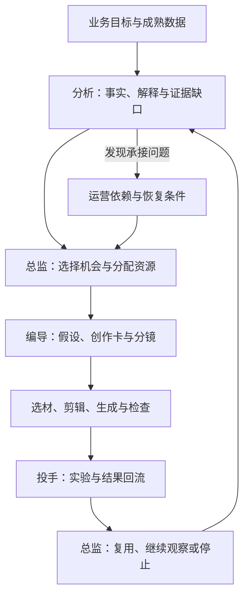

我想解决的需求很具体：**把一条表现不错的千川视频，持续变成更多值得测试的新视频。**

编导判断原片为什么有效，剪辑寻找可用片段，投手安排测试，内容总监决定下一轮方向。素材、报表和工具已经不少，连接这些工作的判断与操作，却仍然大量留在人身上。

我希望把这条工作链交给 Agent：它能根据目标理解数据、提出创意、完成制作，再根据实际结果安排下一次生产。人的日常操作和关注逐步减少，把时间留给新方向与创造；系统足够成熟后，也能够接手其中更多专业判断。

因此，我把它定位为**内容自主生产系统**。资产管理与能力复用是基础，完整任务能否持续完成，才是衡量它的关键。

> 本文是截至 2026 年 9 月的设计与阶段记录。下文贯穿案例为虚构的设计示例；文末另列实际核验过的本地媒体产物。完整业务闭环仍在建设中，二者不能混为实测投放成绩。

## 从一次复剪任务看，数据怎样进入生产

假设我们有一条 30 秒的挂车视频，介绍一款收纳产品。它在可比素材中表现不错，商品点击也有吸引力，但点击后的支付转化偏弱。原片直到第 15 秒才开始真实演示，此前用了较长篇幅介绍卖点。

任务可以很简单：“再裂变三个版本。”但 Agent 必须先知道，值得改变的到底是什么。

分析角色先核对观察窗口、成交成熟度、价格、库存、商品页和受众变化。如果同期商品页出了问题，任务应转向承接修复；继续剪视频没有充分依据。假设这些检查没有发现明确异常，分析才提出一个待验证解释：**用户有兴趣，但在购买前没有及时看到足够具体的证明。**

这仍然是解释，不是已经成立的原因。内容总监据此决定是否值得分配制作与测试资源，编导再把它转成可执行的创意假设。

| 工作项 | 本例中的设计 |
| --- | --- |
| 业务目标 | 挂车成交，观察点击后支付，并等待退款等结果成熟 |
| 受众与阻力 | 对收纳有需求，但不确定实际容量和使用过程 |
| 创意假设 | 在开头之后立即展示真实装载过程，可能减少理解与信任阻力 |
| 本轮改变 | 将原片的演示段前移，调整信息顺序 |
| 本轮保留 | 商品、价格、开头、原有口播片段、配乐与 CTA；不同时更换表达机制 |
| 继续观察或放弃 | 样本不足则不下结论；若在可比条件下没有改善，或退款表现恶化，则不推广这个版本 |

这里的“保留”也是制作约束。如果移动片段以后指代不清、配音不连贯，剪辑不能为了凑齐版本随意改口播。它应报告缺陷，让编导修订方案并留下新版本。

### Creative Craft 在这里提供什么

Creative Craft 提供理解 Brief、形成概念、组织叙事和评审的方法。在本例中，我计划让编导将这些方法落实为一张简短的创作卡：

> **主张：** 让用户看清楚这款产品能装什么、如何使用。
>
> **证明：** 使用已有、可核实的装载演示，不用生成镜头替代商品性能证据。
>
> **开头：** 保留原有问题场景。
>
> **叙事：** 问题 → 演示 → 卖点解释 → 行动引导。
>
> **评审重点：** 演示是否支撑主张，产品是否一致，前后指代是否连贯，是否引入了未证实的容量承诺。

这张卡是设计示例，尚不是某次真实 Agent 运行的输出。它说明专业方法如何影响实际制作：研究角色按“能证明实际使用”的要求找片段，剪辑按叙事意图编排，评审按同一主张检查成片。各角色共享判断依据。

### 片段如何进入时间线

为便于说明，把原片划分成四段。下列时间均为示意，区间按左闭右开处理，正常速度播放。

| 片段 | 源片范围 | 叙事作用 | 原版 A 的成片位置 | 实验版 B 的成片位置 |
| --- | --- | --- | --- | --- |
| S1 | 0—3 秒 | 问题与开头 | 0—3 秒 | 0—3 秒 |
| S2 | 3—15 秒 | 卖点介绍 | 3—15 秒 | 9—21 秒 |
| S3 | 15—21 秒 | 真实演示 | 15—21 秒 | 3—9 秒 |
| S4 | 21—30 秒 | 解释与行动引导 | 21—30 秒 | 21—30 秒 |

B 仍为 30 秒，复用同一组内容，先验证顺序变化。字幕与片段原声跟随对应时间映射，配乐和最终 CTA 保持原有安排；生成后再检查切点、音画连续性、遮挡和商品表达。

本轮只需要原版 A 与实验版 B。其他方向，例如更换开头或补充使用场景，可以另建假设，避免把几种变化混在一起。系统不应为了完成“三条”的字面数量，输出三个无法解释差异的版本。

投手接收的也不只是一份 MP4，还包括这次假设、改变项、保留项和测试要求。是否具备有效对照、如何分配流量、观察到什么时点，都要在具体账户与预算条件下确定。平台自然给某版更多流量，不能直接当成随机实验。

本例没有执行真实投放，因此结论停在“待测试”。将来即使 B 表现更好，也应记录为特定商品、受众与条件下的证据，再决定复用范围。

## 同一套框架，允许不同的业务判断

上面的案例是挂车成交。换成直播引流，视频完成的任务和后续承接都会变化。

| 场景 | 首先判断什么 | 必须一起看的条件 |
| --- | --- | --- |
| 直播引流 | 是否带来了成本合理、符合目标的进房用户 | 可得的真实进房与后续行为，直播货盘、活动和主播承接 |
| 挂车成交 | 是否获得了符合经营要求的成交 | 点击后支付、归因窗口、退款结算、价格库存与商品页 |
| 自然内容 | 是否完成本次受众触达、信任、搜索或行动目标 | 实际可得的行为数据和后续价值 |

业务目标和流量来源分开记录，自然内容也可以引流或成交。点击不一定是进房，支付投产不等于净成交投产，更不等于利润。账户的整体成交也不能直接摊成某个镜头的贡献。

统一的工作框架是：**目标 → 事实与诊断 → 创意假设 → 制作 → 实验 → 经验**。框架一致，各环节采用的指标与判断条件随任务变化。直播间没有及时展示对应商品时，系统应该处理承接依赖，而不是继续生产同类视频。



总监还要平衡修复、有效机制扩展和新方向探索，避免全系统只追逐历史赢家。没有历史成绩的新素材也需要受约束的测试机会。

### 选材要利用数据，也要保留证据边界

整片表现好，只能支持从中寻找候选表达；时间段上的观看与点击变化，可以帮助定位问题；在明确条件下做受控比较，才能进一步检验片段或结构变化的作用。

例如某个时间点观看人数下降，也可能是用户完成了点击。缺少行为上下文时，不能直接给那个镜头打低分。因此，我设计的选材顺序是：使用条件与商品事实 → 分镜作用与连续性 → 可比的表现证据。

TikTok 的 [Video Insights](https://ads.tiktok.com/resources/help/article/video-insights?lang=en) 为时间位置上的观看与点击分析提供了参考，但国内千川能获取哪些字段，仍须按实际账户核验。缺失数据保留为缺失，不补成零；整片关联也不升级成片段的因果贡献。

## Harness 工程：让判断成为可恢复的工作

我将组织上下文、工具、任务状态、执行约束和反馈的这一层，称为面向内容生产的 **Agent Harness Engineering**。OpenAI 的 [Harness Engineering 实践](https://openai.com/index/harness-engineering/)讨论了通过环境、知识和反馈支持 Agent 完成软件工作；我借鉴这些机制，内容生产的效果仍需独立验证。

DataHub 提供业务事实、素材、权限和执行记录；Creative Craft 提供创作与评审方法；专业 Agent 在这些条件下选择行动，工具负责真实执行。以下两个机制，是我认为必须先做扎实的部分，**它们描述的是完整设计合同，不代表当前全部实现。**

### 机制一：用一条版本链交接，替代口头转述

在复剪案例中，我希望各角色交接同一条记录链：

```text
业务 Brief → 证据快照 → 创意假设 H1 → 制作计划
          → 工程版本 B-r1 → 成片及检查 → 实验 → 观察 → 经验
```

编导交给剪辑的最小工作单，可以这样表示。它是说明数据关系的伪结构，不是当前 API 请求格式：

```json
{
  "hypothesis": "H1: 证明前移",
  "evidence_snapshot": "E1",
  "baseline_revision": "A-r1",
  "variant": "B",
  "segment_order": ["S1", "S3", "S2", "S4"],
  "preserve": ["商品", "价格", "开头", "片段口播", "配乐", "CTA"],
  "required_checks": ["来源与使用条件", "商品一致性", "字幕音画连续性"]
}
```

Agent 可以选择候选片段、提出编辑和修订；控制器负责验证权限、版本、预算和必需交付物。模型说“完成”只是提议，实际文件、检查结果及状态转换共同决定该阶段是否结束。

若价格或素材使用条件变化，受影响的计划需要重新校验。若编导改了假设，则产生新版本，保留旧版本与费用。这样，投放结果可以追溯到当时究竟改变了什么，而不会被后来修改的聊天记录覆盖。

### 机制二：恢复任务时，先确定已经发生了什么

渲染可能执行几分钟，业务结果可能几天后才成熟。它们不能靠同一个一直等待的 Agent 会话维持。

我计划让 PostgreSQL 保存任务真相，由 Rust 控制器执行状态转换；Python Worker 领取有期限的任务，调用分析、模型和媒体工具。周期触发与巡检可以由 Prefect 承担，但不维护第二套成功状态。

| 中断位置 | 恢复规则 |
| --- | --- |
| 片段分析或本地渲染中断 | 从冻结输入恢复；过期执行者失去提交权，新尝试保留独立记录 |
| 成片已写入、任务尚未确认 | 校验对象与摘要，确认归属后提交结果，避免覆盖已有产物 |
| 平台收到请求，但本地超时 | 标记结果未知，保留动作身份与预算预留；先查询对账，不立即重发 |
| 成片完成，成交尚未成熟 | 结束制作阶段，另建观察任务，到期读取数据，不占用渲染槽 |

不能查询的外部动作，也不能自动当成失败重做；它进入异常处理。取消本地任务不等于撤稿或退款，迟到的外部结果仍需对账。

专业判断交给 Agent，权限、版本、资金预留和提交权用明确规则执行。这种分工让自主性有可检查的边界，也减少人反复查进度、重启任务和补救重复操作。

## 经验如何进入下一轮，而不固化错误

在本例中，假设 B 点击更高，但支付没有成熟，经验只能停在观察中。即使成交改善，仍要记录对照条件、样本与不确定性；若退款恶化，不能只保留点击提升的结论。

我计划把可复用经验与原假设、实际产物、实验和观察关联，明确商品、受众、目标、时间窗口及反例。总监据此安排下一轮验证；价格、活动或商品事实变化时，相关经验重新检查。无有效对照的经营观察可以用于决策，但不能变成无条件的因果规则。

学习也不必从微调开始。先用可解释规则与相近案例辅助排序，再用积累的实验数据评估模型；按时间与创意家族隔离训练和评测，避免近似视频泄漏。候选方法没有改善，就继续保留原基线。

Adobe Research 的 [Experimentation Accelerator](https://arxiv.org/html/2602.13852v1) 为连接历史实验、内容表征和候选排序提供了参考，但原研究的文案与点击率任务不能直接当成短视频成交模型。[TikTok Split Testing](https://ads.tiktok.com/resources/help/article/split-testing?lang=en)则提醒我区分平台流量分配与有效对照。

## 当前能拿出什么证据

完整闭环尚未贯通。目前已有资产与平台素材关联、数据导入、分析诊断基础，以及项目版本、顺序时间线、片段检索和规划等局部实现。其中部分制作能力仍来自未提交工作区，不能写成已发布产品。

为了把“已有产物”说具体，这次我重新读取了两组本地 MP4 与原始回执，计算 SHA-256，并用 ffprobe 核对媒体流：

| 现有样本 | 本次文件核验 | 能说明什么 |
| --- | --- | --- |
| 双片段试剪 | 6 秒，720×1280，H.264 视频与 AAC 音频；文件摘要与原回执一致 | 存在非连续片段拼接的本地输出；不证明创意或投放质量 |
| HTTP→Worker 测试输出 | 2 秒，360×640，H.264 视频与 AAC 音频；文件摘要与原回执一致 | 留存了本地链路测试产物；本次没有重新执行整链路 |

[查看脱敏核验摘要（JSON）](/evidence/content-agent-local-verification-2026-09-20.json)。它是从已有产物整理的公开摘要，不是新生成的原始运行回执。原视频含业务素材，未随文章公开，因此读者不能仅凭该摘要独立复现实验。

原本地测试使用真实 HTTP、数据库、Worker 与渲染流程，对象服务则是 loopback TLS/SigV4 夹具；部分规划与语义测试使用模拟模型响应。本次文件核验没有补齐云端存储、真实模型质量、平台发布或经营效果的证据，也没有进行新的播放听审。

| 层次 | 当前状态与下一步 |
| --- | --- |
| 制作基础 | 已有局部实现与本地产物；继续验证目标环境、真实供应商与视听质量 |
| 统一业务框架 | 已完成工作总纲与六份规格；需要落实为真实输入输出和验收 |
| 效果驱动制作 | 尚未完整贯通；将目标、证据、假设和实验约束接入规划与选片 |
| 自主生产与经营 | 百条级容量、持续自主运行和实际投放增益均待验证 |

接下来最关键的一步，是让一条真实、脱敏的业务任务走完本文的记录链。先用历史回放检查当时可得的事实与合理动作，不能提前透露结果；再在有权限、有预算的真实账户中做小规模验证。样本不足时继续保留未知。

## 先衡量人是否被解放，再谈日产多少条

我会用下面几组指标评价系统，而不把生成文件数当成成功：

| 问题 | 计划统计的口径 |
| --- | --- |
| 能否独立完成制作 | 无人工干预且通过验收的交付数／事前冻结的制作目标数；失败和人工救回不从分母中删除 |
| 是否减少人的负担 | 每批人工介入次数与分钟数；质检、修订、恢复和平台桥接分别记录 |
| 产物是否可用 | 首次验收通过率、返工率、合格成片成本；成本包含失败与重试 |
| 是否形成有效反馈 | 实验完成情况、数据成熟与回流时间、结论限制；有效实验不要求结果正向 |
| 是否达到全链路自主 | 制作、授权平台动作、结果回流与对账均自动完成的比例；不与制作自主率混用 |

这些是待测指标，不是已经达到的成绩。业务目标、测试窗口和质量标准在评测前确定，不能为了好看事后换分母。

初期围绕少量商品，每个生产日按需完成约 10—20 条候选；稳定后具备每日约 100 条的处理能力。千条级属于多商品、多账户的长期扩展。生产数量、新增测试数量和持续在投数量分别记录，避免制造超出预算与流量承接能力的候选积压。

初期以已有素材复剪为主，确有缺口时生成补充镜头，完整生成保留独立试验额度。分析、检索、渲染、存储、生成秒数、废片和人工介入均计入制作成本，广告测试另行记账。先有实测输入，再计算单条费用。

专业剪辑、多 Agent、全量历史索引、多引擎、完整生成和微调仍在完整建设范围内。实施顺序由依赖和验证结果决定，产能不会替代质量或自主性的验收。

## 制作工具和研究，各自吸收什么

统一剪辑工程记录素材、轨道和时间映射，再适配具体引擎；不支持的效果明确返回，不能静默丢失。FFmpeg 承担基础媒体与编码能力，模板、程序化视频和精修按任务选择对应工具。

Creative Craft 的研究参考保留以下七个项目。表中是学习方向，不表示七套产品已全部集成，也不构成它们当前能力或许可的完整评估。

| 项目 | 研究方向 |
| --- | --- |
| [HyperFrames](https://github.com/heygen-com/hyperframes) | 程序化视频与场景组织；本地样本回执已记录其 producer 引擎 |
| [ChatCut Agent Plugin](https://github.com/ChatCut-Inc/agent-plugin) | 读取工程、执行有界编辑并检查结果 |
| [OpenChatCut](https://github.com/0xsline/OpenChatCut) | 人与 Agent 共用编辑操作和状态 |
| [OpenMontage](https://github.com/calesthio/OpenMontage) | 参考片、分镜与混合制作流程 |
| [Remotion](https://github.com/remotion-dev/remotion) | 参数化视频模板与动效 |
| [Cerul](https://github.com/cerul-ai/cerul) | 多路检索、时间定位与索引组织 |
| [OpenCut](https://github.com/OpenCut-app/OpenCut) | 时间线、项目结构与专业精修 |

正式采用时还需固定版本、核对许可与部署条件，并通过自己的工程合同验证。Agent 的编排和评价则参考 Anthropic 的[任务编排与有界反馈](https://www.anthropic.com/engineering/building-effective-agents)、[Agent 评测](https://www.anthropic.com/engineering/demystifying-evals-for-ai-agents)：技术正确、创意意图、表达质量和经营结果分别检验。

## 我想交给系统的，是完整任务

成熟后的系统应能持续观察目标与效果，自己发现机会、安排制作、检查产物、执行获授权的实验，再决定下一批做什么。素材撤权、价格变化、预算不足或外部状态未知时，它也应知道哪些动作需要停下、哪些工作还能继续。

这条路的价值，会体现在越来越少的人工搬运、催进度和重复判断上。人不必继续充当各个工具之间的连接器，才能把更多注意力投入新的问题与创造。

我想建设的生产力，最终落在一件具体的事上：交给系统一个内容任务，它能够把事情做完，留下可检查的结果，并让下一次做得更好。

---

本文属于「从 DataHub 到 AI Hub」系列。上一篇：[让业务事实可靠地流动](/posts/from-datahub-to-ai-hub-01-datahub-foundation/)，介绍支撑判断与行动的数据底座。
